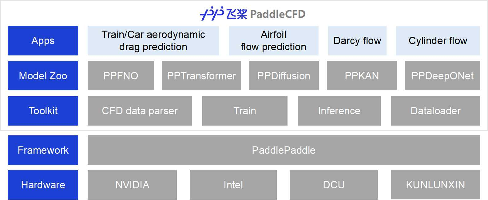

# PaddleCFD

## About PaddleCFD

PaddleCFD is a deep learning toolkit for surrogate modeling, equation discovery, shape optimization and flow-control strategy discovery in the field of fluid mechanics. Currently, it mainly supports surrogate modeling, including models based on Fourier Neural Operator (FNO), Transformer, Diffusion Model (DM),  Kolmogorov-Arnold Networks (KAN) and DeepONet.




## Code structure

- `config`: config files for different tasks
- `doc`: documentation
- `examples`: example scripts
- `ppcfd/data`: data-process source code
- `ppcfd/model`: model source code
- `ppcfd/utils`: util code

## How to run

### Installation

##### Conda environment installation

```bash
conda create --name ppcfd python=3.10
conda activate ppcfd

python -m pip install -r requirements.txt -i https://pypi.tuna.tsinghua.edu.cn/simple
python -m pip install paddlepaddle-gpu==3.0.0 -i https://www.paddlepaddle.org.cn/packages/stable/cu118/

# Download and install paddle-backended Open3D
wget https://paddle-org.bj.bcebos.com/paddlecfd/envs/open3d-0.18.0+da239b25-cp310-cp310-manylinux_2_31_x86_64.whl
python -m pip install open3d-0.18.0+da239b25-cp310-cp310-manylinux_2_31_x86_64.whl -i https://pypi.tuna.tsinghua.edu.cn/simple

# Unzip compiled customed operator (fused_segment_csr) to conda env directory
wget https://paddle-org.bj.bcebos.com/paddlecfd/envs/fused_segment_csr.tar.gz
tar -xzvf fused_segment_csr.tar.gz -C /root/miniconda3/envs/ppcfd/
```

##### PaddleCFD package installation
```bash
# Install PaddleCFD from sourcecode
python -m pip install -e . -i https://pypi.tuna.tsinghua.edu.cn/simple
```

### Quick start
```bash
# Run examples
cd PaddleCFD/examples/xxx/xxx
run the example according to the example README.md
```

## APIs

[ppcfd/data](./doc/data.md)

## License

PaddleCFD is provided under the [Apache-2.0 license](./LICENSE)
