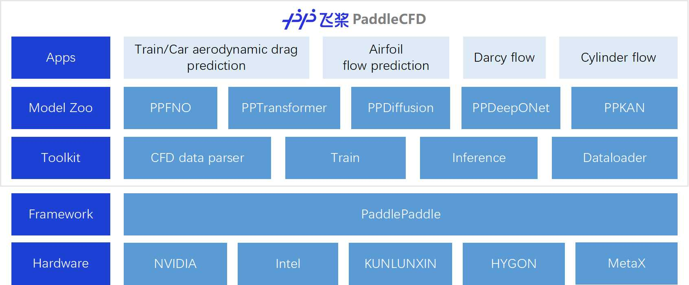

# PaddleCFD

## About PaddleCFD

PaddleCFD is a deep learning toolkit for surrogate modeling, equation discovery, shape optimization and flow-control strategy discovery in the field of fluid mechanics. Currently, it mainly supports surrogate modeling, including models based on Fourier Neural Operator (FNO), Transformer, Diffusion Model (DM),  Kolmogorov-Arnold Networks (KAN) and DeepONet.




## Code structure

- `doc`: documentation
- `examples`: example scripts
- `ppcfd/data`: data-process source code
- `ppcfd/model`: model source code
- `ppcfd/utils`: utils code

## How to run

### Installation

##### Image pulling & container running

```bash 
# Pull docker image
docker pull ccr-2vdh3abv-pub.cnc.bj.baidubce.com/paddlepaddle/paddle:3.0.0-gpu-cuda11.8-cudnn8.9-trt8.6

# Run docker container
nvidia-docker run --name ppcfd-container -v /home/:/home --network=host -it  --shm-size 64g ccr-2vdh3abv-pub.cnc.bj.baidubce.com/paddlepaddle/paddle:3.0.0-gpu-cuda11.8-cudnn8.9-trt8.6 /bin/bash
```

##### Conda environment installation

```bash
# Clone PaddleCFD
git clone https://github.com/PaddlePaddle/PaddleCFD.git
cd PaddleCFD

# Create conda environment
conda create --name ppcfd python=3.10
conda activate ppcfd

# Install requirements
python -m pip install -r requirements.txt -i https://pypi.tuna.tsinghua.edu.cn/simple
python -m pip install paddlepaddle-gpu==3.0.0 -i https://www.paddlepaddle.org.cn/packages/stable/cu118/
apt-get install -y libgl1-mesa-glx

# Download and install paddle-backended Open3D
wget https://paddle-org.bj.bcebos.com/paddlecfd/envs/open3d-0.18.0+da239b25-cp310-cp310-manylinux_2_31_x86_64.whl
python -m pip install open3d-0.18.0+da239b25-cp310-cp310-manylinux_2_31_x86_64.whl -i https://pypi.tuna.tsinghua.edu.cn/simple

# Unzip compiled customed operator (fused_segment_csr) to conda env directory
wget https://paddle-org.bj.bcebos.com/paddlecfd/envs/fused_segment_csr.tar.gz
tar -xzvf fused_segment_csr.tar.gz -C /root/miniconda3/envs/ppcfd/

# Add environment variable
export LD_LIBRARY_PATH=/root/miniconda3/envs/ppcfd/lib/python3.10/site-packages/paddle/libs:$LD_LIBRARY_PATH
export LD_LIBRARY_PATH=/root/miniconda3/envs/ppcfd/lib/python3.10/site-packages/paddle/base:$LD_LIBRARY_PATH
export LD_LIBRARY_PATH=/root/miniconda3/envs/ppcfd/lib:$LD_LIBRARY_PATH
```

##### PaddleCFD package installation
```bash
# Install PaddleCFD from sourcecode at PaddleCFD root directory
python -m pip install -e . -i https://pypi.tuna.tsinghua.edu.cn/simple

# Install PaddleCFD from pypi
python -m pip install ppcfd -i https://pypi.tuna.tsinghua.edu.cn/simple
```

### Quick start
```bash
# Run examples
cd PaddleCFD/examples/xxx/xxx
run the example according to the example README.md
```

## APIs

[ppcfd/data](./doc/data.md)

## Community
Join PaddleCFD WeChat group to discuss with us!


## License

PaddleCFD is provided under the [Apache-2.0 license](./LICENSE)
