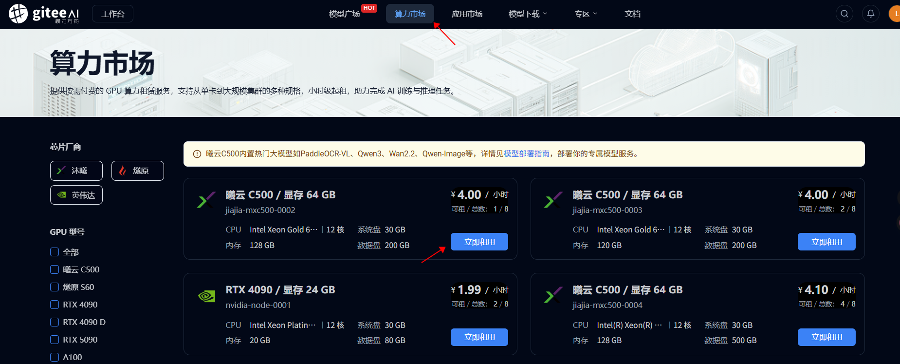
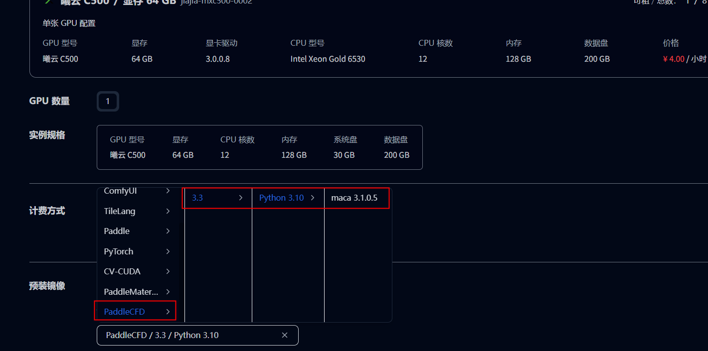
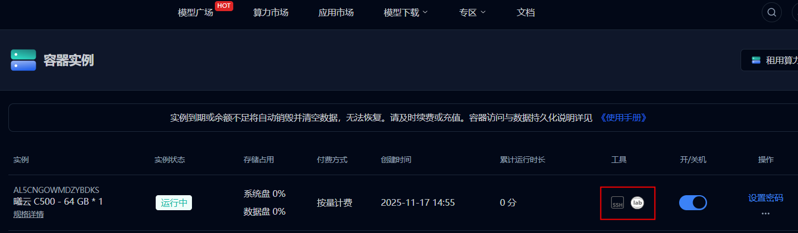
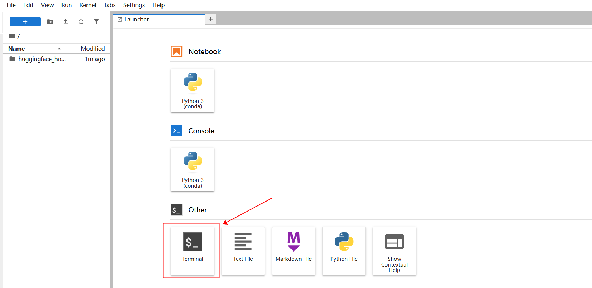

## Environment Preparation
### 1.Register an account and log in on the giteeAi platform
https://ai.gitee.com/
### 2.购买算力, 点击 '立即租用'

### 3.selecting the PaddleCFD image, click Next to create an instance.

### 4.Once the instance is created, as shown below, click on Lab to enter the container.

### 5.clicking Jupyter Lab, you will enter this interface. First, select the terminal; this article chooses Terminal.

## Training Process
Using the aerodynamics case as an example to explain the training process:
```
cd /opt/package/ppcfd/PaddleCFD/examples/aerodynamics/ppkan
```
### 1.Get the dataset
```sh
wget https://paddle-org.bj.bcebos.com/paddlecfd/datasets/ppkan/AirFoilDataset.zip
unzip AirFoilDataset.zip
```
### 2.Check config at first

Check setting of `DATA.path` in Airfoil/main.yaml, pls make sure the
path is correctly modified to the dataset directory where you download the 
AirfRANS dataset.

### 3.Train

```sh
python main.py model=KANONet
```

### 4.Eval

```python
python main.py mode=test checkpoint="your checkpoint path"
```
# References and citations

Reference paper: 10.1016/j.cma.2024.117699