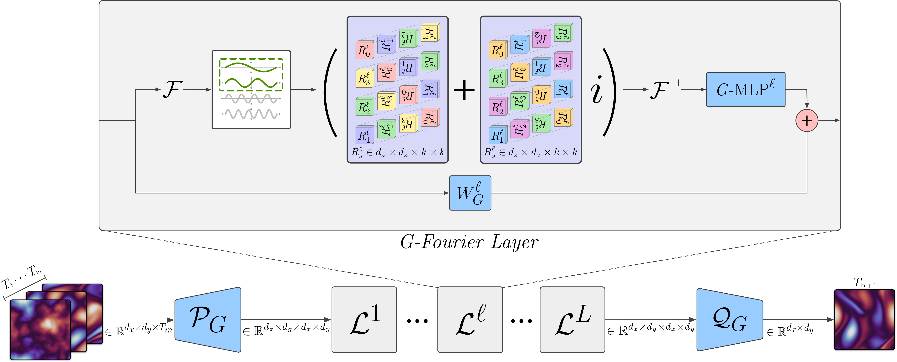

# G-FNO

## 1. Background

G-FNO (Group Equivariant Fourier Neural Operator) is an operator-learning model for PDE surrogate modeling. Built on top of the Fourier Neural Operator (FNO), it generalizes the core operators (spectral convolution, 1×1 convolution, normalization) into **group-equivariant** versions, so the whole network is strictly equivariant under discrete symmetry groups. Injecting symmetry as an inductive bias notably improves data efficiency and generalization on PDE solving tasks.

This directory provides a PaddlePaddle implementation of G-FNO, covering 2D/3D FNO, GCNN, GFNO, Ghybrid, and radialNO variants, with an optional dynamic-to-static + CINN path (currently a net slowdown — see section 6).



### Key Features

- **Group equivariance**: strictly equivariant under `p4` (the 4-element rotation group C4) and `p4m` (rotations + reflections, the D4 group); equivariance can be verified from the training log
- **Spectral integral operator**: group-equivariant frequency-domain convolution with Hermitian spectral kernels; complex parameters are stored as real values and rebuilt on the fly to stay compatible with the Paddle optimizer
- **Multiple datasets**: supports Navier-Stokes and shallow-water (PDEArena / PDEBench) PDE data
- **Optional CINN path**: a single environment variable switches on dynamic-to-static + CINN compiled training, while the default dynamic-graph behavior is unchanged. 

### Reference Paper

| Year | Venue | Authors                                                                           | Link                                               |
| ---- | ----- | --------------------------------------------------------------------------------- | -------------------------------------------------- |
| 2023 | ICML  | Jacob Helwig, Xuan Zhang, Cong Fu, Jerry Kurtin, Stephan Wojtowytsch, Shuiwang Ji | [Paper](https://icml.cc/virtual/2023/poster/23875) |

---

## 2. Model Description

Taking `GFNO2d` as an example, the overall skeleton follows a standard FNO, but every operator is replaced by a group-equivariant counterpart (prefixed with `G` in the code):

```
Input (B, Sx, Sy, T_in·C)
  │
  ├─ grid          append grid coordinates (symmetric / cartesian)
  ├─ GConv2d  (p)  lift to width channels (first_layer)
  │
  ├─ 4 × Fourier layers, each:
  │     x1 = GMLP ( GNorm ( GSpectralConv ( GNorm(x) ) ) )   ← spectral integral operator K + nonlinearity
  │     x2 = GConv2d 1×1 (w)                                   ← linear branch W
  │     x  = gelu(x1 + x2)                                     ← residual fusion
  │
  └─ GMLP2d (q)    project back to output channels (last_layer)
Output (B, Sx, Sy, 1, 1)
```

Core group-equivariant operators:

| Operator                              | Role                                                                                            |
| ------------------------------------- | ----------------------------------------------------------------------------------------------- |
| `GConv2d` / `GConv3d`                 | Group-equivariant convolution; shares rotation/reflection kernels over the stabilizer dimension |
| `GSpectralConv2d` / `GSpectralConv3d` | Group-equivariant spectral integral operator with Hermitian frequency kernels                   |
| `GNorm`                               | Group-equivariant normalization (`InstanceNorm3D`, no trainable affine parameters)              |
| `GMLP2d` / `GMLP3d`                   | Two-layer `GConv2d` 1×1 + GELU nonlinear module                                                 |

**Group variants**:

- `p4`: rotation group C4, `group_size = 4`
- `p4m`: D4 group (with reflections), `group_size = 8`, roughly 2× the parameters of `p4`

**Equivariance**: the model satisfies $f(g\cdot x)=g\cdot f(x)$ under every group element. `experiments.py` prints `Rotations` / `Reflections` equivariance error metrics before and after training; the rotation equivariance error should be close to 0.

> Note: this Paddle implementation drops the steerable and Unet variants (`*_steer`, `Unet_Rot*`) that depend on non-Paddle equivariance libraries. The main use case `GFNO2d_p4` is unaffected.

---

## 3. Dataset

`experiments.py` auto-dispatches the data format from `--data_path` (by file extension, directory name, or filename prefix). Place all datasets under a local `data/` directory and pass the path to `experiments.py`.

### 3.1 Supported data sources

| Dataset                    | Source                                                                              | Files / format                                                                                                                | Auto-dispatch                    | Dataset-specific flags                                   |
| -------------------------- | ----------------------------------------------------------------------------------- | ----------------------------------------------------------------------------------------------------------------------------- | -------------------------------- | -------------------------------------------------------- |
| NS (non-symmetric forcing) | [FNO GitHub](https://github.com/neuraloperator/neuraloperator/tree/master)          | `ns_V1e-4_N10000_T30.mat` (10,000 downsampled trajectories) + `ns_data_V1e-4_N20_T50_R256test.mat` (20 super-resolution test) | `.mat` extension                 | `--T=20 --super --super_path=<super .mat>`               |
| NS-Sym (symmetric forcing) | generated locally, see below                                                        | `ns_V0.001_N1200_T30_cos4.mat` (1,200 trajectories) + `ns_V0.001_N1200_T30_cos4_super.mat` (100 super-resolution test)        | `.mat` extension                 | `--T=10 --super --super_path=<super .mat>`               |
| SWE (PDEArena)             | [PDEArena data generation instructions](https://microsoft.github.io/pdearena/data/) | `ShallowWater2D/` with `train/valid/test.zarr` and `normstats.pt`                                                             | directory named `ShallowWater2D` | `--T=9 --time_pad --modes=32` (no `--super`)             |
| SWE (PDEBench)             | [PDEBench GitHub](https://github.com/pdebench/PDEBench), 2D shallow-water           | `2D_rdb_NA_NA.h5`, trajectories of shape `(101, X, Y, 1)` float32                                                             | filename starting with `2D_rdb`  | `--T=24 --rdb_super_res=<native res> --rdb_downsample=4` |

NS-Sym is generated with the bundled script (from `examples/G-FNO`):

```bash
python "data_generation/navier_stokes/ns_2d_rt.py" --nu=1e-4 --T=30 --N=1200 --save_path="./data" --ntest=100 --period=4 --device=auto
```

### 3.2 Tested data: SWE-PDEBench (verified)

The PDEBench shallow-water dataset is the mainline used for development and verification (loss alignment and CINN enablement). The rdb branch average-pools the spatial dimensions by `--rdb_downsample` and requires `--T=24`; `--super` enables the built-in super-resolution test (the loader retains the native-resolution test trajectories, so no `--super_path` is needed). Both scales below have been verified for training in dynamic-graph and CINN modes:

| Scale | Native resolution | Trajectories | Size   | `--rdb_super_res` | `--rdb_downsample` | After downsample | `--modes` |
| ----- | ----------------- | ------------ | ------ | ----------------- | ------------------ | ---------------- | --------- |
| Full  | 128×128           | 1000         | ~6.6GB | 128               | 4                  | 32×32            | 12        |
| Small | 64×64             | 200          | ~333MB | 64                | 4                  | 16×16            | 8         |

> - `modes` must be ≤ the downsampled resolution (16×16 → modes ≤ 8; 32×32 → modes can be 12).
> - The rdb loader reads all trajectories into memory at once; the full dataset needs roughly 13GB of host RAM. On memory-constrained machines, a subset of trajectories in the same format works identically.

---

## 4. Installation

At the PaddleCFD repository root:

```bash
python -m pip install -r requirements.txt
python -m pip install -e .
```

The G-FNO runtime needs only the PaddleCFD root dependencies; no extra packages.

---

## 5. Training

### 5.1 Supported `--model_type`

`FNO2d`, `FNO2d_aug`, `FNO3d`, `FNO3d_aug`, `GCNN2d_p4`, `GCNN2d_p4m`, `GCNN3d_p4`, `GCNN3d_p4m`, `GFNO2d_p4`, `GFNO2d_p4m`, `GFNO3d_p4`, `GFNO3d_p4m`, `Ghybrid2d_p4`, `Ghybrid2d_p4m`, `radialNO2d_p4`, `radialNO2d_p4m`, `radialNO3d_p4`, `radialNO3d_p4m`

The mainline use case is `GFNO2d_p4` (`reflection=False`).

### 5.2 Launch from examples

Enter `examples/G-FNO`. Example with the small SWE-PDEBench dataset:

```bash
cd examples/G-FNO
python "experiments.py" --seed=1 --data_path="./data/2D_rdb_NA_NA.h5" \
    --results_path="./results/2D_rdb_NA_NA_small/GFNO2d_p4" --strategy=teacher_forcing \
    --T=24 --ntrain=160 --nvalid=20 --ntest=20 --model_type=GFNO2d_p4 \
    --modes=8 --width=10 --batch_size=32 --epochs=100 --learning_rate=1e-3 \
    --early_stopping=100 --verbose --rdb_super_res=64 --rdb_downsample=4 --device=auto
```

For the full dataset, set `--rdb_super_res=128`, `--modes=12`, and scale `--ntrain/--nvalid/--ntest` as needed.

### 5.3 Key hyperparameters

| Argument     | Meaning                                                    | Mainline value         |
| ------------ | ---------------------------------------------------------- | ---------------------- |
| `--modes`    | number of retained Fourier modes                           | 8 (16×16) / 12 (32×32) |
| `--width`    | hidden channel width                                       | 10                     |
| `--T`        | number of future timesteps to predict                      | fixed 24 for rdb       |
| `--strategy` | `teacher_forcing` / `recurrent` / `markov` / `oneshot`(3D) | teacher_forcing        |
| `--device`   | runtime device                                             | auto (cpu/gpu/...)     |

> Note: to offset the extra parameters introduced by the stabilizer dimension, G-FNO typically **reduces channel width rather than modes** (see the paper, Appendix A.2).

### 5.4 Evaluation

There is no standalone evaluation command. Evaluation runs automatically at the end of every `experiments.py` run: the best-validation checkpoint (`{results_path}/<timestamp>[_<suffix>]/model.pt`, saved whenever validation improves) is reloaded, and the script reports test error, rotation/reflection equivariance errors, mean per-step inference time, and — with `--super` — super-resolution test errors (not supported for PDEArena). Evaluating an existing checkpoint therefore requires a training run; no checkpoint-loading eval entry is provided.

---

## 6. CINN Dynamic-to-Static

G-FNO supports a CINN-compiled dynamic-to-static training path, controlled by a **single environment variable** and disabled by default (pure dynamic graph, unchanged behavior):

```bash
GFNO_USE_CINN=1 python "experiments.py" ...   # enable CINN dynamic-to-static
```

When enabled, `experiments.py` sets the relevant primitive/CINN FLAGS and wraps the model with `paddle.jit.to_static(..., full_graph=False)` (SOT).

**On `GFNO2d_p4` this path is currently a net slowdown and is not recommended.** Steady-state training time per step (single H100, PaddlePaddle 3.3.1, `width=10`, `batch_size=32`, compile cost excluded):

| Configuration           | 16×16 | 32×32 | 64×64 |
| ----------------------- | ----- | ----- | ----- |
| Dynamic graph (default) | 25.8  | 25.7  | 26.1  |
| `to_static` only        | 39.6  | 37.9  | 38.6  |
| `to_static` + CINN      | 38.2  | 39.1  | 38.9  |

Accuracy is unaffected (test error differs by <1%, floating-point noise).

Reasons:

- **The model is host-bound.** 374 of the 435 ops in one forward pass are the group-equivariant weight reassembly in `GConv2d.get_weight()` — small layout ops (`flip`/`roll`/`transpose`/`concat`/`stack`) whose cost is Python dispatch, not GPU work. Actual math (4 `einsum` + 4 FFT) is only ~4% of the forward pass. Step time is identical at 16×16 and 64×64, so raising the resolution does not help.
- **The regression comes from `to_static`, not CINN.** The whole ~13 ms is already there without CINN. `get_weight()` builds intermediates into Python lists, which makes SOT break the graph into fragments too small to be converted, so only one CINN subgraph is compiled per run — SOT pays the trace/guard cost and recovers no dispatch cost.
- **CINN cannot reach the spectral core**, which is `complex64` (unsupported) and uses `einsum` (no `InferSymbolicShapeInterface`). This caps the possible gain at that ~4%.

The fix is to reduce the op count: the C4 lifting is a constant permutation plus sign flips, so a precomputed index tensor with one `index_select` can replace the whole `rot90 → roll → concat` chain. Only `GFNO2d_p4` (`reflection=False`) has been measured; `p4m` variants are dynamic-graph only.


## 7. Import Models From Installed PaddleCFD

```python
from ppcfd.models.g_fno import FNO2d, GFNO2d

gfno = GFNO2d(
    num_channels=1,
    modes=12,
    width=10,
    initial_step=10,
    reflection=False,
    grid_type="symmetric",
)
```

---

## 8. Citation

```latex
@inproceedings{helwig2023group,
author = {Jacob Helwig and Xuan Zhang and Cong Fu and Jerry Kurtin and Stephan Wojtowytsch and Shuiwang Ji},
title = {Group Equivariant {Fourier} Neural Operators for Partial Differential Equations},
booktitle = {Proceedings of the 40th International Conference on Machine Learning},
year = {2023},
}
```
