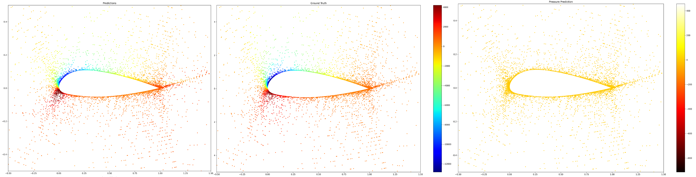

# PP-DeepOKAN
This is an onging project to combine the K-A representation theorem with Operator Learning model to endow the network architecture with better high-frequency expressivity with fewer learnable parameters.
## Introduction

### I. Kolmogorov-Arnold representation theorem
Kolmogorov-Arnold representation theorem states that if $f$ is a multivariate continuous function
on a bounded domain, then it can be written as a finite composition of continuous functions of a
single variable and the binary operation of addition. More specifically, for a smooth function $f : [0,1]^n \to \mathbb{R}^1$,


$$f(x) = f(x_1,...,x_n)=\sum_{q=1}^{2n+1}\Phi_q(\sum_{p=1}^n \phi_{q,p}(x_p))$$

where $\phi_{q,p}:[0,1]\to\mathbb{R}$ and $\Phi_q:\mathbb{R}\to\mathbb{R}$. In a sense, they showed that the only true multivariate function is addition, since every other function can be written using univariate functions and sum. However, this 2-Layer width-(2n+1) Kolmogorov-Arnold representation may not be smooth due to its limited expressive power. We augment its expressive power by generalizing it to arbitrary depths and widths.

### II. Kolmogorov-Arnold Networks (KAN)
KANs are neural networks inspired by the Kolmogorov-Arnold theorem, where:

**Inner functions $(𝜙_{𝑞,𝑝})$:** 
transform input variables independently, uni-variable functions that connect the hidden neurons, which are the learnable edge function of the KAN.

**Outer functions $(Φ_𝑞)$:**
combine these transformations through summation and nonlinear mappings.

Unlike traditional MLPs (Multilayer Perceptrons), which apply fixed activation functions to weighted sums, KANs:

Use learnable univariate functions (e.g., splines, radial basis functions) instead of fixed activations.

Allow adaptive composition of functions across layers, improving interpretability and expressiveness.

KANs are particularly effective for function approximation with high frequency information and scientific machine learning, where interpretability and smoothness are crucial.

### III. DeepOKAN
DeepONet is a neural operator architecture designed to learn mappings between infinite-dimensional function spaces, making it ideal for solving parametric PDEs. It consists of:

**Branch Net**: Processes input functions (e.g., boundary conditions, geometric parameters). The branch net can be more than one to encode different conditioning information. We employ single/ multiple KAN networks for input functions encoding.

**Trunk Net**: Evaluates the output function at query points in the domain. The trunk net serves as the base neural field to approximate the PDE solution function. Similarly, the trunk net can also be a KAN network or other archs.

The output is a dot product of branch and trunk net features:

$$ G(u)(y) = \sum_{k=1}^p {b_k(u)} \cdot {t_k(y)} $$

where 𝑢 is the input function, 𝑦 is the query point (typically is the coordinates of any domain points), and $𝑏_𝑘$, $𝑡_𝑘$ are the hidden outputs of branch and trunk nets, respectively.

DeepONet excels in tasks like fluid dynamics, where the solution (e.g., velocity/pressure fields) depends on input parameters (e.g., Reynolds number, geometry). In the following chapter, we are going to ellaborate on an common task in aerodynamics, airfoil flow fields predcition, to illustrate the application of DeepOKAN.

### IV. Application example: airfoil modeling
Given an airfoil’s:

1. **Geometric parameters** (e.g., coordinates, curvature),

2. **Flow conditions** (e.g., angle of attack, freestream velocity),

PP-DeepOKAN predicts the velocity and pressure distributions over the domain by:

**Branch Network (KAN-based)**: Encodes airfoil geometry and flow conditions into latent features.
$$b_k = KAN(geometry, \alpha, U_\infty)$$
where 𝛼 is the angle of attack and $𝑈_\infty$ is the inlet velocity.
**Trunk Network (KAN-based)**:

Evaluates the solution at spatial coordinates (𝑥, 𝑦).

$$t_k = KAN(x, y)$$

**Arch Illustration**


The final output is a generalized superposition of branch and trunk features:
$$Velocity(x, y) = \sum_{k=1}^p b_k(x, y) \cdot t_k(x, y), Pressure(x, y) = \sum_{k=1}^p b_k(x, y) \cdot t_k(x, y)$$

**Results**:

The pressure field prediction MRE on the test set is 9.8%, the major contribution of error comes from the far field region.
## Code

```sh
git clone https://github.com/PaddlePaddle/PaddleCFD.git
```

## Envs

```sh
pwd
cd ../../
env PYTHONPATH=$PYTHONPATH:$(pwd)   # set temporary path
pip install -r requirements.txt -i https://pypi.tuna.tsinghua.edu.cn/simple
cd ./examples/aerodynamics/ppkan
pip install -r requirements.txt -i https://pypi.tuna.tsinghua.edu.cn/simple
```

## Data

We use the open-source dataset AirfRANS for airfoil task, more details about the data and preprocess methods please refer to [Paper](https://airfrans.readthedocs.io/en/latest/notes/introduction.html). You can either follow the subsequent instructions or acquire the same data following the instructions of the mentioned website.

### Get the dataset

#### If you want to get all files

```sh
wget https://paddle-org.bj.bcebos.com/paddlecfd/datasets/ppkan/AirFoilDataset.zip
unzip AirFoilDataset.zip
```

### Prepocess scripts

See `dataset_creation_sim.py`. This file is invoked in `main.py` to generate the dataset and is not supposed to be run directly.
Noted: the airfoil geometry is extracted using a specific intorpolating method, which is NURBS curve fitting algorithm.

## Run

### If you want to use our pretrained model

### Check config at first

Check setting of `DATA.path` in Airfoil/main.yaml, pls make sure the
path is correctly modified to the dataset directory where you download the 
AirfRANS dataset.

#### Train

```sh
env PYTHONPATH=$PYTHONPATH:$(pwd)
python main.py model=KANONet
```

#### Eval

```python
python main.py mode=test checkpoint="your checkpoint path"
# or using our pretrained checkpoint: https://paddle-org.bj.bcebos.com/paddlecfd/checkpoints/ppkan/foil/1B-63-1T-2-KANONet_latest.pdparams
```

# References and citations

Reference paper: 10.1016/j.cma.2024.117699


Reference code: https://github.com/DiabAbu/DeepOKAN
