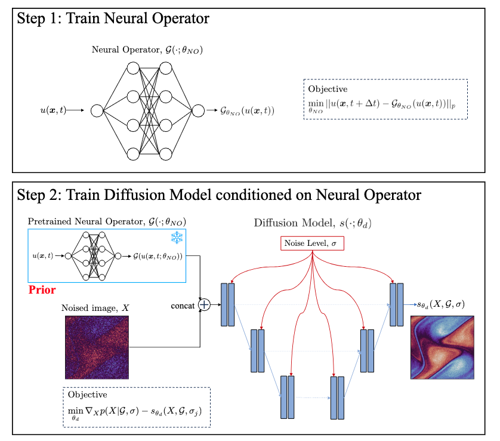

# NODM for Turbulent Airfoil Wake Prediction

## 1.Background

- The Complexity of Turbulence
  - Turbulence is considered one of the last frontiers in classical physics.
  - Due to multi-scale spatiotemporal structures generated by energy cascades at high Reynolds numbers, direct numerical simulation (DNS) can currently only handle low Reynolds numbers and simplified geometries, even with modern supercomputers.

- Limitations of Traditional Methods
  - DNS and Large Eddy Simulation (LES) offer high accuracy but are computationally extremely expensive.
  - Experimental techniques (such as PIV, PTV, Schlieren) can provide partial information but cannot deliver complete statistical quantities like DNS, especially at high frequencies and wavenumbers.

- Advantages and Limitations of Neural Operators
  - Neural Operators (NOs) can learn operator mappings, enabling rapid predictions under different boundary conditions and parameters, with very high computational efficiency.
  - However, they exhibit spectral bias: tending to learn low-frequency components while neglecting high-frequency details, leading to overly smooth predictions that fail to accurately represent the fine-scale structures of turbulence.

- Potential of Generative Models
  - Generative AI models (such as GANs, Normalizing Flows, Diffusion Models) have demonstrated excellent high-frequency capturing capabilities in image generation, producing structures with correct spectral distributions.
  - Diffusion models, through iterative denoising, have a self-regressive characteristic in the frequency domain, making them naturally suitable for compensating neural operators' deficiencies in high-frequency modeling.

To address these limitations, **NODM (Neural Operator + Diffusion Model)** combines neural operators as efficient priors with diffusion models that enhance spectral fidelity, enabling high-quality predictions of turbulent flows such as the airfoil wake.


## 2.NODM Model Overview
The NODM framework consists of two main stages:

1. **Neural Operator (NO) Training**
   - Learns the mapping between input conditions and flow field outputs.
   - Provides a low-frequency approximation of the flow field.

2. **Diffusion Model (DM) Training**
   - Conditioned on the neural operator outputs (prior).
   - Recovers missing high-frequency details using score-based diffusion and Langevin dynamics sampling.

This hybrid approach combines the **efficiency of NOs** with the **spectral accuracy of DMs**, resulting in predictions that align more closely with the true turbulence spectra. Its structure is shown in Figure.




## 3.Dataset Description

This project uses the **Turbulent Airfoil Wake** dataset from [A Database for Reduced-Complexity Modeling of Fluid Flows](https://doi.org/10.2514/1.J062203).

- **Problem setup**
  - Geometry: NACA0012 airfoil
  - Reynolds number: Re = 23,000
  - Mach number: M = 0.3
  - Angle of attack: 6°

- **Dataset**
  - Generated via **Large Eddy Simulation (LES)**
  - 3D flow field, with the streamwise velocity component $u$ extracted at the mid-span slice
  - Temporal resolution: $\tau = 0.0104 L_c/U_\infty$
  - 16,000 snapshots in total; a subset of 1,000 timesteps is used here

- **Data split**
  - Training: 80%
  - Validation: 10%
  - Testing: 10%

- **Task**
  - Input: a history of flow states ${u_{t-50\tau}, \dots, u_t}$
  - Output: future flow states ${u_{t+5\tau}, u_{t+10\tau}, \dots}$
  - The NO provides low-frequency predictions, while the DM enhances the high-frequency content.


## 4.Model Training & Evaluation

#### 4.1 Download Datasets

First, download the dataset from the University of Michigan's Deep Blue Data Repository:

- Visit [Deep Blue Data Repository](https://deepblue.lib.umich.edu/data/collections/kk91fk98z?locale=en).
- Navigate to the section: **Turbulent airfoil wake large eddy simulation**.
- Download the files: `airfoilLES_snapshots_midspan.zip`, `airfoilLES_grid.h5`.
- Place both files in the `data/` directory and unzip `airfoilLES_snapshots_midspan.zip`.

If the link above does not work, you may also refer to:
[A Database for Reduced-Complexity Modeling of Fluid Flows](https://doi.org/10.2514/1.J062203).


#### 4.2 Data Preparation

```sh
cd data/
python data_prep.py
```

This script processes the raw dataset and generates the following preprocessed files:

* `mask.npy`
* `UX.npy`
* `UX_nan_filtered.npy`

#### 4.3 Train the Neural Operator

Navigate to the `nodm/` folder and run:

```sh
cd nodm/
python train_no.py
```

This will train the Neural Operator model and save the best checkpoint to:
`models/best_model.pdparams`.

#### 4.4 Prepare Data for the Diffusion Model

```sh
# Use the trained Neural Operator weights or download pretrained weights
wget -nc -P ./models/ https://paddle-org.bj.bcebos.com/paddlecfd/checkpoints/nodm/no_model.pdparams

python no_postprocess.py
```

This script uses the trained Neural Operator to post-process the data and generate:

* `TRAIN_TRUE.npy`, `TRAIN_PRED.npy`
* `VAL_TRUE.npy`, `VAL_PRED.npy`
* `TEST_TRUE.npy`, `TEST_PRED.npy`

These files are used as input for the Diffusion Model training.

#### 4.5 Train the Diffusion Model

Navigate to the `nodm/dm/` folder and run:

```sh
cd nodm/dm/
python train_dm.py
```

This will train the Diffusion Model and save the best checkpoint to:
`dm/models/best_model.pdparams`.

#### 4.6 Post-process Results

```sh
# Use the trained Diffusion Model weights or download pretrained weights
wget -nc -P ./models/ https://paddle-org.bj.bcebos.com/paddlecfd/checkpoints/nodm/dm_model.pdparams

python dm_postprocess.py
```
This script applies the trained Diffusion Model for post-processing, generating the final prediction results.


## 5. Visualization of Results

Below are some example visualizations comparing the ground truth LES, Neural Operator predictions, and NODM (NO + DM) predictions.


The NODM framework significantly improves the spectral alignment compared to Neural Operators alone, especially in the high-frequency range.

Results & Advantages

- Energy spectrum: Predictions better align with LES, especially in the high-frequency range.
- Long-term forecasts: Diffusion correction stabilizes autoregressive rollouts and mitigates error accumulation.
- General applicability: The NODM framework is flexible and can be extended to other turbulence problems and scientific domains.

## 6. Reference Links

* [Integrating Neural Operators with Diffusion Models Improves Spectral Representation in Turbulence Modeling](https://doi.org/10.48550/arXiv.2409.08477)
* [A Database for Reduced-Complexity Modeling of Fluid Flows](https://doi.org/10.2514/1.J062203)
* [https://github.com/vivekoommen/NeuralOperator_DiffusionModel](https://github.com/vivekoommen/NeuralOperator_DiffusionModel)
