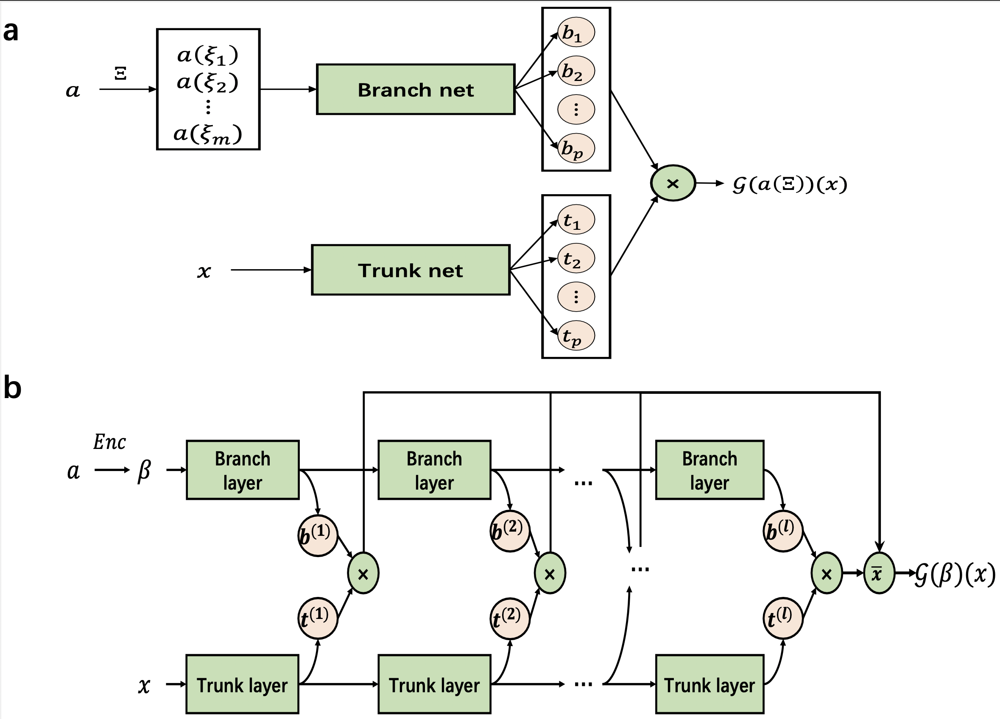

# Darcy’s Flow

## 1. Background

**Darcy’s Flow** is a classical model describing low-speed fluid flow in porous media. It was first proposed in 1856 by French engineer Henry Darcy during experimental studies of the water supply system in Dijon. Through experiments, Darcy discovered that the water flow rate through sand was proportional to the pressure gradient and inversely proportional to the fluid’s viscosity. This relationship was later summarized as **Darcy’s Law**, forming the foundation of seepage mechanics and groundwater hydrology. Darcy flow assumes slow fluid motion (low Reynolds number), where inertial forces are negligible compared to viscous forces and pressure gradients. Therefore, the flow is linear, applicable to porous media such as soil, rock, and biological tissues.

Darcy flow finds extensive applications in groundwater hydrology, petroleum engineering, geothermal systems, biological tissue permeability, and industrial filtration. In groundwater studies, Darcy’s Law simulates aquifer dynamics and evaluates water resource distribution and contaminant transport. In petroleum engineering, it aids in predicting subsurface flow to optimize extraction strategies. In biomedical fields, Darcy flow models analyze blood transport in capillary networks or drug delivery in tissues. Although originally empirical, Darcy’s Law has a concise mathematical form and clear physical meaning, making it the core framework for flow in porous media.

With further research, the limitations of Darcy flow have become evident. For instance, under high-speed flow, inertial effects become significant and the flow may deviate from linearity, necessitating **non-Darcy models** such as the Forchheimer or Brinkman equations. Additionally, for heterogeneous porous media, anisotropic materials, or complex fluids (e.g., non-Newtonian), Darcy’s Law must be extended with more complex constitutive relations or numerical methods such as finite elements or lattice Boltzmann methods. In recent years, Darcy flow research has been coupled with multi-physics problems—e.g., thermo-fluid-solid interactions (as in geothermal systems), or chemical transport processes (as in pollutant migration)—further promoting its application in engineering and science. As a bridge between theory and practice, Darcy flow remains a vital tool in subsurface mechanics and resource development.

## 2. Problem Definition

Consider a domain $\Omega \subset \mathbb{R}^d$ (usually 2D or 3D), where the pressure field $u(x)$ satisfies the following PDE:

$$
\nabla \cdot (a(x) \nabla u(x)) = f(x), \quad x \in \Omega,
$$

Where:

* $u(x)$: scalar pressure field (unknown to solve for)
* $a(x) > 0$: permeability (also known as conductivity coefficient or tensor), dependent on position
* $f(x)$: source term (positive for inflow, negative for outflow)
* $\nabla \cdot$: divergence operator
* $\nabla u$: pressure gradient

The equation is typically accompanied by **Dirichlet** or **Neumann** boundary conditions:

* **Dirichlet condition (known pressure)**:

$$
u(x) = g(x), \quad x \in \partial\Omega_D,
$$

* **Neumann condition (known flux)**:

$$
(a(x) \nabla u(x)) \cdot \mathbf{n}(x) = h(x), \quad x \in \partial\Omega_N,
$$

where $\partial\Omega = \partial\Omega_D \cup \partial\Omega_N$ and $\mathbf{n}(x)$ is the outward normal vector at the boundary.

In this case, we consider a 2D Darcy flow problem. The governing equation becomes:

$$
-\nabla \cdot (a(x_1,x_2) \nabla u(x_1,x_2)) = f(x_1,x_2), \quad(x_1,x_2) \in \Omega = [0,1]^2,
$$

$$
u(x_1,x_2) = 0, \quad (x_1,x_2) \in \partial \Omega,
$$

where $f = 10$ is a constant. The forward problem is to determine the mapping from the permeability field $a(x_1,x_2)$ to the pressure field $u(x_1,x_2)$, i.e., $\mathcal{G}: a(x_1,x_2) \to u(x_1,x_2)$.

## 3. Model Design

### 3.1 MultiONet

We adopt a novel neural operator architecture called **MultiONet**. Its structure is shown in Figure b.



Similar to DeepONet, MultiONet employs a separated representation consisting of two neural networks: a **trunk network** that encodes the spatial coordinates ${x} \in \Omega$ of the solution, and a **branch network** that extracts features from an input vector ${\beta}$, which is learned from the input coefficient field $a$ via an encoder. Unlike DeepONet, MultiONet computes the final output by **averaging multiple inner products from various branch and trunk layers**, rather than relying solely on the final layer outputs. This improves performance without increasing the number of parameters.

As shown in the figure, the input to the branch network in MultiONet is the latent representation ${\beta}$ of the input function. This representation can be learned via an encoder network or extracted using Fourier, Chebyshev, or wavelet transforms. In contrast, DeepONet's branch network takes as input a finite-dimensional discretization $a(\Xi) = {a(\xi_1), \cdots, a(\xi_m)}$, sampled at predefined sensor points $\Xi = {\xi_1, \cdots, \xi_m}$. This gives MultiONet greater flexibility in input representation and significantly reduces computational costs when $\Xi$ is large. Furthermore, while $a(\Xi)$ lies in a high-dimensional, irregular space (especially in multiphase media with discontinuities), the latent space ${\beta}$ is low-dimensional, continuous, and regular—making optimization in inverse problems more efficient and robust.

MultiONet also outperforms DeepONet in approximation capacity, even with the same number of parameters. This is primarily due to its averaging mechanism, akin to ensemble learning, which aggregates predictions from multiple functional bases. In DeepONet, the output is:

$$
\mathcal{G}(a(\Xi))({x}) = \sum^{p}_{k=1}b_k(a(\Xi))t_k({x}) + b_0,
$$

where $b_k(a(\Xi))$ and $t_k({x})$ are the $k$-th outputs of the branch and trunk networks, and $b_0$ is a bias term. In contrast, MultiONet computes:

$$
\mathcal{G}({\beta})({x}) =\frac{1}{l} \sum^{l}_{k=1}\left(b^{(k)}({\beta})\odot t^{(k)}({x}) +b^{(k)}_0\right),
$$

where $b^{(k)}({\beta})$ and $t^{(k)}({x})$ are outputs from the $k$-th branch and trunk layers, respectively, $l$ is the total number of layers, $b^{(k)}_0$ is a bias term, and $\odot$ denotes inner product. Clearly, DeepONet is a special case of MultiONet when using only the final layer outputs.

If the branch and trunk networks have different numbers of layers, the architecture adjusts the computation accordingly. Let $l_t$ and $l_b$ be the numbers of trunk and branch layers, respectively, with $l_t > l_b$. Then the output becomes:

$$
\mathcal{G}({\beta})({x}) =\frac{1}{l_b} \sum^{l_b}_{k=1}\left(b^{(k)}({\beta})\odot t^{(k+l_t-l_b)}({x}) +b^{(k)}_0\right).
$$

Thus, MultiONet offers enhanced representational capacity and improved operator approximation performance over DeepONet.

### 3.2 Second-Order Optimization: SOAP (Shampoo with Adam in the Preconditioner)

Physics-Informed Neural Networks (PINNs) face fundamental challenges related to *conflicting gradients* during training, which manifest in two distinct ways:

* **The first mode** involves significant differences in the magnitude of backpropagated gradients. When such magnitude imbalances occur, certain loss terms dominate the optimization process, often leading to model failure. While adaptive weighting schemes have partially addressed this issue, a more fundamental form of gradient conflict remains underexplored.

* **The second mode** arises when gradients from different loss components point in *opposite directions*, forcing the optimization to proceed along inefficient paths. Traditional scaling-based methods are insufficient for resolving such directional conflicts—especially in complex PDE systems where multiple physical constraints must be simultaneously satisfied.

These gradient conflicts often indicate that improving one objective requires coordinated changes across multiple parameters—information that is encoded in the *off-diagonal elements of the Hessian matrix*.

**SOAP** (Shampoo with Adam in the Preconditioner) approximates such second-order information in two complementary ways:

* Its **block-diagonal structure** naturally captures parameter interactions within each neural network layer;
* Its **adaptive preconditioner** accumulates information about gradient correlations throughout training. This allows SOAP to implicitly identify and leverage coordinated update directions, improving multiple objectives simultaneously.

SOAP doesn't merely follow the average gradient—it uses the local geometry of the loss landscape to find more direct paths to better solutions.

By optimizing in a transformed space aligned with the preconditioner's principal directions, SOAP enhances the efficiency of Shampoo. For a given layer with weight matrix $W_t$ and gradient $G_t \in \mathbb{R}^{m \times n}$, SOAP maintains two covariance matrices using exponential moving averages:

$$
\begin{align}
    L_t &= \beta_2 L_{t-1} + (1 - \beta_2) G_t G_t^T, \\
    R_t &= \beta_2 R_{t-1} + (1 - \beta_2) G_t^T G_t.
\end{align}
$$

These matrices are then decomposed via eigenvalue decomposition:

$$
L_t = Q_L \Lambda_L Q_L^T, \quad R_t = Q_R \Lambda_R Q_R^T,
$$

where $\Lambda_L$ and $\Lambda_R$ contain eigenvalues that capture the principal curvature directions of the loss landscape.

At each iteration $t$, SOAP updates the weight matrix $W_t$ as follows:

* **Project the gradient into the eigen space**:

$$
\widetilde{G}_t = Q_L^T G_t Q_R.
$$

* **Apply the Adam update in the rotated space**:

$$
\widetilde{W}_{t+1} = \widetilde{W}_t - \eta \cdot Adam(\widetilde{G}_t).
$$

* **Transform back to the original parameter space**:

$$
W_{t+1} = Q_L \widetilde{W}_{t+1} Q_R^T.
$$

To reduce computational overhead, the preconditioners $L_t$ and $R_t$ are updated every $f$ steps in practice.


## 4. Dataset

The point set $\Xi$ used by MultiONet forms a regular $29 \times 29$ grid over domain $\Omega$. The input permeability fields sampled at these grid points yield the training dataset ${\hat{a}^{(i)}}_{i=1}^N$.

To evaluate MultiONet's performance, two test sets are used:

* **In-distribution test set**: 200 samples drawn from the same distribution as training data.
* **Out-of-distribution test set**: 200 samples drawn from a zero-truncated Gaussian process $GP(0, (-\Delta + 16I)^{-2})$. While the value range is similar, higher-order correlation functions differ.

For each sample, the PDE ground truth solution $u$ is computed using the Finite Element Method (FEM) on a $29 \times 29$ grid.

## 5. Model Training & Evaluation

* Download datasets:

```sh
wget -nc -P ./Problems/DarcyFlow_2d/ https://paddle-org.bj.bcebos.com/paddlecfd/datasets/ppdeeponet/darcyflow/smh_train.mat
wget -nc -P ./Problems/DarcyFlow_2d/ https://paddle-org.bj.bcebos.com/paddlecfd/datasets/ppdeeponet/darcyflow/smh_test_in.mat
```

* Train the model:

```sh
python pimultionet.py
```

* Evaluate the model:

```sh
wget -nc -P ./saved_models/PIMultiONetBatch_fdm_TS/ https://paddle-org.bj.bcebos.com/paddlecfd/checkpoints/ppdeeponet/darcyflow/loss_pimultionet.mat
wget -nc -P ./saved_models/PIMultiONetBatch_fdm_TS/ https://paddle-org.bj.bcebos.com/paddlecfd/checkpoints/ppdeeponet/darcyflow/model_enc.pdparams
wget -nc -P ./saved_models/PIMultiONetBatch_fdm_TS/ https://paddle-org.bj.bcebos.com/paddlecfd/checkpoints/ppdeeponet/darcyflow/model_u.pdparams

python pimultionet.py --mode eval
```

## 6. Model Results

The following figure compares the pressure field predicted by PI-MultiONet and the ground truth FEM solution on the test set. As shown, PI-MultiONet performs well and accurately predicts the pressure distribution.


Optimizing with the second-order optimizer **SOAP** can improve model performance. Compared to **AdamW**, SOAP achieves better performance in fewer iterations. The L2 errors of models trained with SOAP and AdamW are **0.0054** and **0.0060**, respectively, representing a **10% improvement in accuracy**.

## 7. Reference Links

* [https://github.com/yaohua32/Deep-Neural-Operators-for-PDEs](https://github.com/yaohua32/Deep-Neural-Operators-for-PDEs)
* [https://github.com/PredictiveIntelligenceLab/jaxpi/tree/pirate](https://github.com/PredictiveIntelligenceLab/jaxpi/tree/pirate)
* [DGenNO: a novel physics-aware neural operator for solving forward and inverse PDE problems based on deep, generative probabilistic modeling](https://doi.org/10.1016/j.jcp.2025.114137)
* [Soap: Improving and stabilizing shampoo using adam](https://arxiv.org/abs/2409.11321)
* [Gradient Alignment in Physics-informed Neural Networks: A Second-Order Optimization Perspective](https://arxiv.org/abs/2502.00604)
