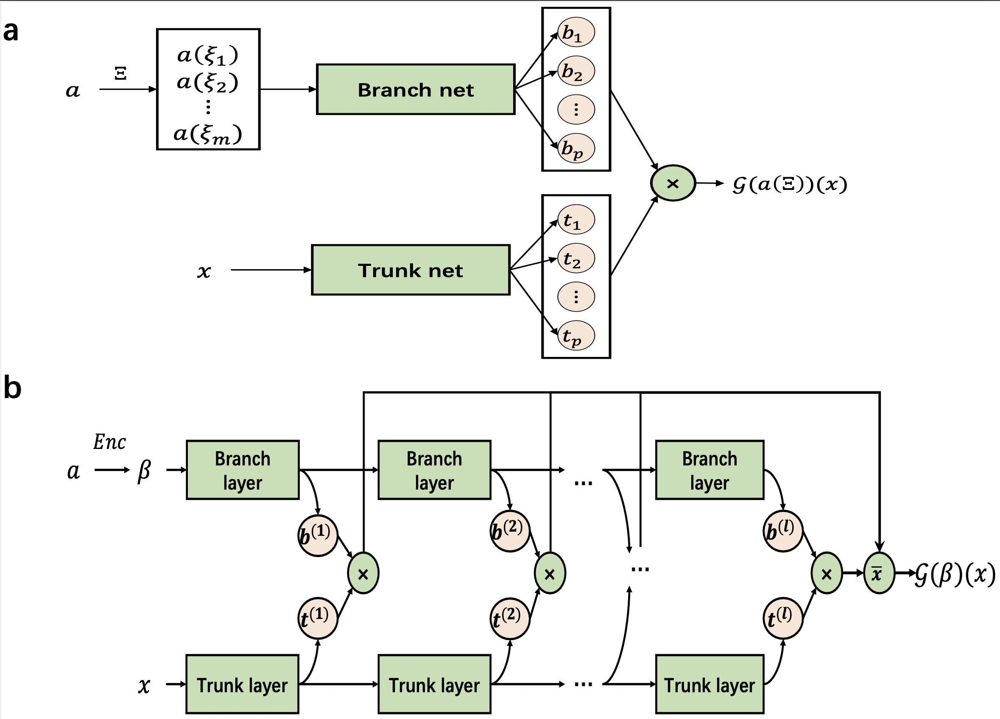
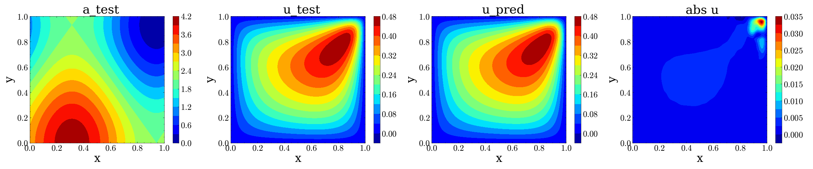

# Darcy’s Flow

## 1. 背景简介

**Darcy’s Flow（达西流）**是描述流体在多孔介质中低速流动的经典模型，由法国工程师亨利·达西（Henry Darcy）在1856年通过实验研究第戎市（Dijon）的供水系统时首次提出。达西通过实验发现，水流通过砂层的流量与压力梯度成正比，与流体粘度成反比，这一规律后来被总结为**达西定律（Darcy’s Law）**，成为渗流力学和地下水文学的基石。达西流假设流体流动缓慢（低雷诺数），且惯性力远小于粘性力和压力梯度，因此流动呈线性关系，适用于土壤、岩石、生物组织等多孔介质中的流体运动。

达西流的应用范围极为广泛，涵盖地下水流动、石油开采、地热工程、生物组织渗透以及工业过滤等领域。在地下水研究中，达西定律用于模拟含水层中的水流动态，评估水资源分布和污染扩散；在石油工程中，它帮助预测油藏中的渗流特性，优化开采方案；而在生物医学领域，达西流模型被用于分析血液在毛细血管网络或药物在组织中的传输过程。尽管达西定律最初基于实验观察，但其数学形式简洁且物理意义明确，成为多孔介质流动理论的核心框架。

随着研究的深入，达西流的局限性也逐渐显现。例如，在高流速条件下，惯性效应不可忽略，流动可能偏离线性关系，此时需采用**非达西模型**，如Forchheimer方程或Brinkman方程加以修正。此外，对于非均质多孔介质、各向异性材料或复杂流体（如非牛顿流体），达西定律需结合更复杂的本构关系或数值方法（如有限元、格子玻尔兹曼方法）进行扩展。近年来，达西流的研究还与多物理场耦合问题紧密结合，例如热-流-固耦合（如地热系统）、化学反应-流动耦合（如污染物迁移）等，进一步推动了其在工程与科学领域的应用。达西流作为连接理论与实践的桥梁，至今仍是渗流力学和资源开发中不可或缺的工具。

## 2. 问题定义

考虑一个区域 $\Omega \subset \mathbb{R}^d$（通常是二维或三维空间），在这个区域中描述压力场 $u(x)$ 的分布，满足以下偏微分方程：

$$
\nabla \cdot (a(x) \nabla u(x)) = f(x), \quad x \in \Omega,
$$

其中：

* $u(x)$ ：标量压力场（待求解）
* $a(x) > 0$ ：空间位置相关的渗透率（Permeability），也称导流系数或张量（可标量也可张量）
* $f(x)$ ：源项，表示体积流入（正）或流出（负）
* $\nabla \cdot$ ：散度算子
* $\nabla u$ ：压力梯度

通常配合 **Dirichlet** 或 **Neumann** 边界条件：

* **Dirichlet 边界条件（压力已知）**：

$$
u(x) = g(x), \quad x \in \partial\Omega_D,
$$

* **Neumann 边界条件（流速已知）**：

$$
(a(x) \nabla u(x)) \cdot \mathbf{n}(x) = h(x), \quad x \in \partial\Omega_N,
$$

其中 $\partial\Omega = \partial\Omega_D \cup \partial\Omega_N$ ，且 $\mathbf{n}(x)$ 是边界外法向量。

在本案例中，我们考虑二维域上的达西流动问题。其控制方程可写为：

$$
-\nabla \cdot (a(x_1,x_2) \nabla u(x_1,x_2)) = f(x_1,x_2), \quad(x_1,x_2) \in \Omega = [0,1]^2,
$$
$$
u(x_1,x_2) = 0, \quad (x_1,x_2) \in \partial \Omega,
$$

这里设为常数 $f=10$ 。对于该正问题，我们关注的是从渗透率场 $a(x_1,x_2)$ 到压力场 $u(x_1,x_2)$ 的映射，即 $\mathcal{G}: a(x_1,x_2) \to u(x_1,x_2)$ 。

## 3. 模型设计

我们采用了一种新颖的神经算子架构，称为 MultiONet 架构。该架构的结构如图b所示。



与DeepONet架构类似，MultiONet架构采用分离表示，由两个神经网络组成：一个被称为“主干网络”，用于编码输出解的空间坐标 ${x} \in \Omega$ ，另一个被称为“分支网络”，用于从输入向量 ${\beta}$ 中提取特征，该 ${\beta}$ 是通过编码器模型自动从输入系数 $a$ 中学习得到的。然而，不同于DeepONet架构，MultiONet架构通过多个主干和分支层的输出向量的平均值来计算最终输出，而不是仅依赖于主干和分支网络输出层的乘积。这一设计在不增加网络参数数量的情况下提升了性能。

如图b所示，MultiONet中分支网络的输入是输入函数的（潜在）表示 ${\beta}$ 。这个表示可以通过学习编码器网络获得，也可以通过傅里叶、切比雪夫或小波变换等方法提取特征。相比之下，DeepONet中的分支网络直接接受离散化的有限维表示 $a(\Xi) = \{a(\xi_1), \cdots, a(\xi_m)\}$ ，这些值对应于预定义的传感器集 $\Xi = \{\xi_1, \cdots, \xi_m\}$ 在 $a$ 上的采样值。这一关键差异使得MultiONet架构在选择分支网络输入方面具有更大灵活性，并且在传感器集 $\Xi$ 较大时大大减少了计算时间。此外，虽然 $a(\Xi)$ 处于高维且不规则的空间（例如在多相介质中， $a$ 是具有不连续性和离散值的场），但潜在空间 ${\beta}$ 是低维的、连续值且规则的。这一转变在解决反问题时具有显著优势，因为在潜在空间中进行优化更高效、更稳健。

此外，MultiONet架构在逼近能力方面优于DeepONet，即使两者参数数量相同。这种改进主要源于MultiONet架构中的平均机制，如图所示，它类似于集成学习的效果，通过汇总多个函数基底的预测结果。在DeepONet架构中，输出是分支和主干网络输出的内积，表达式为：

$$
\mathcal{G}(a(\Xi))({x}) = \sum^{p}_{k=1}b_k(a(\Xi))t_k({x}) + b_0,
$$

其中， $b_k(a(\Xi))$ 和 $t_k({x})$ 分别是分支和主干网络第 $k$ 个分量的输出， $b_0$ 为偏置项。而所提出的MultiONet架构则通过平均多个层的输出内积来计算，表达式为：

$$
\mathcal{G}({\beta})({x}) =\frac{1}{l} \sum^{l}_{k=1}\left(b^{(k)}({\beta})\odot t^{(k)}({x}) +b^{(k)}_0\right),
$$

其中， $b^{(k)}({\beta})$ 和 $t^{(k)}({x})$ 分别表示第 $k$ 层的分支和主干网络的输出， $l$ 为总层数， $b^{(k)}_0$ 为偏置项， $\odot$ 代表内积操作。很容易看出，当只使用分支和主干网络最后层的输出时，DeepONet可以视为MultiONet的一种特例。

为了处理分支网络和主干网络层数不同的情况，架构对输出计算方式进行了如下修改。设 $l_t$ 和 $l_b$ 分别表示主干网络和分支网络的层数，且假设 $l_t > l_b$ 。此时，最终输出通过平均以下形式的内积来计算：

$$
\mathcal{G}({\beta})({x}) =\frac{1}{l_b} \sum^{l_b}_{k=1}\left(b^{(k)}({\beta})\odot t^{(k+l_t-l_b)}({x}) +b^{(k)}_0\right).
$$

MultiONet架构通过提供比DeepONet更强的表达能力，这种增强的表示能力在作为算子逼近器时表现出更优的性能。

## 4.数据集

MultiONet所用的点集 $\Xi$ 取在区域 $\Omega$ 上的规则 $29\times 29$ 网格。输入系数场在相同位置的取值构成了训练数据集 $\{\hat{a}^{(i)}\}_{i=1}^N$ ，用于训练 MultiONet。

为了评估MultiONet方法的性能，我们采用了两个测试数据集：

- **内部分布（in-distribution）测试集**：从训练数据相同的分布中采样 200 个系数字段 $a$ ；
- **分布外（out-of-distribution）测试集**：采样自零截断的高斯过程 $GP(0, (-\Delta + 16I)^{-2})$ 。虽然系数字段的取值范围相同，但其二阶及更高阶的相关函数不同。

我们为每个测试集生成了 200 个样本，并使用有限元法（FEM）在规则 $29\times 29$ 网格上计算对应的 PDE 精确解  $u$。

## 5. 模型训练与评估

- 加载数据集

``` sh
wget -nc -P ./Problems/DarcyFlow_2d/ https://paddle-org.bj.bcebos.com/paddlecfd/datasets/ppdeeponet/darcyflow/smh_train.mat
wget -nc -P ./Problems/DarcyFlow_2d/ https://paddle-org.bj.bcebos.com/paddlecfd/datasets/ppdeeponet/darcyflow/smh_test_in.mat
```

- 模型训练

``` sh
python pimultionet.py
```

- 模型评估

``` sh
wget -nc -P ./saved_models/PIMultiONetBatch_fdm_TS/ https://paddle-org.bj.bcebos.com/paddlecfd/checkpoints/ppdeeponet/darcyflow/loss_pimultionet.mat
wget -nc -P ./saved_models/PIMultiONetBatch_fdm_TS/ https://paddle-org.bj.bcebos.com/paddlecfd/checkpoints/ppdeeponet/darcyflow/model_enc.pdparams
wget -nc -P ./saved_models/PIMultiONetBatch_fdm_TS/ https://paddle-org.bj.bcebos.com/paddlecfd/checkpoints/ppdeeponet/darcyflow/model_u.pdparams

python pimultionet.py --mode eval
```

## 6. 模型结果

如图展示了PI-MultiONet在测试集上预测的压力场与有限元解的对比。可以看出，PI-MultiONet在测试集上表现良好，能够准确预测压力场。



使用二阶优化器SOAP进行优化，可以提升模型的性能。与AdamW相比，SOAP能够在更少的迭代次数内达到更好的性能。使用SOAP、AdamW分别训练的模型的L2误差分别为0.0054和0.0060，精度提高了10%。

## 7. 参考链接

- https://github.com/yaohua32/Deep-Neural-Operators-for-PDEs
- [DGenNO: a novel physics-aware neural operator for solving forward and inverse PDE problems based on deep, generative probabilistic modeling](https://doi.org/10.1016/j.jcp.2025.114137)


# 2D-LDC(2D Lid Driven Cavity Flow)

在运行代码前先安装依赖库[PaddleScience](https://paddlescience-docs.readthedocs.io/zh-cn/latest/)，可按照官网上的安装使用进行安装，或在终端运行以下命令：
 ``` sh
 python -m pip install -U paddlesci -i https://pypi.tuna.tsinghua.edu.cn/simple
 ```

=== "Re=3200"

    === "模型训练命令"

        ``` sh
        # linux
        wget -nc -P ./data/ \
            https://paddle-org.bj.bcebos.com/paddlescience/datasets/ldc/ldc_Re100.mat \
            https://paddle-org.bj.bcebos.com/paddlescience/datasets/ldc/ldc_Re400.mat \
            https://paddle-org.bj.bcebos.com/paddlescience/datasets/ldc/ldc_Re1000.mat \
            https://paddle-org.bj.bcebos.com/paddlescience/datasets/ldc/ldc_Re1600.mat \
            https://paddle-org.bj.bcebos.com/paddlescience/datasets/ldc/ldc_Re3200.mat
        # windows
        # curl https://paddle-org.bj.bcebos.com/paddlescience/datasets/ldc/ldc_Re100.mat --create-dirs -o ./data/ldc_Re100.mat
        # curl https://paddle-org.bj.bcebos.com/paddlescience/datasets/ldc/ldc_Re400.mat --create-dirs -o ./data/ldc_Re400.mat
        # curl https://paddle-org.bj.bcebos.com/paddlescience/datasets/ldc/ldc_Re1000.mat --create-dirs -o ./data/ldc_Re1000.mat
        # curl https://paddle-org.bj.bcebos.com/paddlescience/datasets/ldc/ldc_Re1600.mat --create-dirs -o ./data/ldc_Re1600.mat
        # curl https://paddle-org.bj.bcebos.com/paddlescience/datasets/ldc/ldc_Re3200.mat --create-dirs -o ./data/ldc_Re3200.mat
        python ldc_2d_Re3200_piratenet.py TRAIN.optim=soap
        ```

    === "模型评估命令"

        ``` sh
        # linux
        wget -nc -P ./data/ https://paddle-org.bj.bcebos.com/paddlescience/datasets/ldc/ldc_Re3200.mat
        # windows
        # curl https://paddle-org.bj.bcebos.com/paddlescience/datasets/ldc/ldc_Re3200.mat --create-dirs -o ./data/ldc_Re3200.mat
        python ldc_2d_Re3200_piratenet.py mode=eval EVAL.pretrained_model_path=https://paddle-org.bj.bcebos.com/paddlecfd/checkpoints/pppinn/ldc_2d_Re3200.pdparams
        ```

    === "模型导出命令"

        ``` sh
        python ldc_2d_Re3200_piratenet.py mode=export
        ```

    === "模型推理命令"

        ``` sh
        # linux
        wget -nc -P ./data/ https://paddle-org.bj.bcebos.com/paddlescience/datasets/ldc/ldc_Re3200.mat
        # windows
        # curl https://paddle-org.bj.bcebos.com/paddlescience/datasets/ldc/ldc_Re3200.mat --create-dirs -o ./data/ldc_Re3200.mat
        python ldc_2d_Re3200_piratenet.py mode=infer
        ```

    | 预训练模型  | Re  | 指标 |
    | :-- | :-- | :-- |
    | - | 100 | U_validator/loss: 0.00011<br>U_validator/L2Rel.U: 0.03896 |
    | - | 400 | U_validator/loss: 0.00024<br>U_validator/L2Rel.U: 0.05432 |
    | - | 1000 | U_validator/loss: 0.00020<br>U_validator/L2Rel.U: 0.04845 |
    | - | 1600 | U_validator/loss: 0.00080<br>U_validator/L2Rel.U: 0.09351 |
    | [**ldc_re3200_piratenet_pretrained.pdparams**](https://paddle-org.bj.bcebos.com/paddlecfd/checkpoints/pppinn/ldc_2d_Re3200.pdparams) | 3200 | **U_validator/loss: 0.00013<br>U_validator/L2Rel.U: 0.03713** |

本案例仅提供 $Re=3200$ 一种情况下的预训练模型，若需要其他雷诺数下的预训练模型，请执行训练命令手动训练即可得到各雷诺数下的模型权重。

## 1. 背景简介

顶盖驱动方腔流（Lid-driven cavity flow）是计算流体力学（CFD）领域经典的基准问题之一，用于研究封闭空间内由剪切力驱动的流体运动。该问题的模型通常是一个二维或三维的方形（或立方体）腔体，内部充满不可压缩流体，其中顶盖以恒定速度沿水平方向运动，而其余壁面保持静止。顶盖的运动通过粘性作用带动腔内流体形成复杂的涡旋结构，其流动特性主要由雷诺数（Re）决定，即流体惯性力与粘性力的比值。在低雷诺数下，流动呈现稳定的单涡结构；随着雷诺数增大，会出现次级涡、流动不对称性，甚至过渡到湍流状态。这一简单却富含物理现象的模型，使其成为验证数值算法精度和稳定性的理想选择。

顶盖驱动方腔流的研究不仅具有理论意义，还与许多工程应用相关，例如涂层工艺、微流体器件设计以及搅拌混合过程等。由于其实验设置相对简单，但流动行为却十分丰富，该问题成为CFD方法发展的重要试金石。早期的高分辨率数值模拟，如Ghia等人在1982年的工作，为不同雷诺数下的流动提供了基准解，至今仍被广泛引用。然而，尽管几何边界简单，该问题在高雷诺数下仍存在数值挑战，例如边界奇点处理、湍流建模以及三维端壁效应的捕捉等。此外，实际实验中还需克服机械振动和边界滑移等问题，以准确复现理论结果。

近年来，顶盖驱动方腔流的研究已扩展到更复杂的场景，包括非牛顿流体行为、多物理场耦合（如热对流或磁流体力学效应）以及几何变形腔体等。同时，随着高性能计算和先进数值方法的发展，该问题继续为研究湍流机理、涡动力学和数值算法优化提供重要平台。开源CFD软件（如OpenFOAM）和标准化基准数据库（如TAMUCFD）的普及，进一步推动了该问题在科研和教学中的应用，使其成为连接流体力学理论与工程实践的经典范例。

## 2. 问题定义

顶盖驱动方腔流（Lid-driven cavity flow）问题的数学描述基于 **不可压缩 Navier-Stokes 方程**，并施加相应的边界条件，其解的特性由雷诺数（Reynolds number） $Re$ 主导，是验证数值方法（如有限差分、有限体积、谱方法等）的经典基准问题。流体运动遵循 **质量守恒（连续性方程）** 和 **动量守恒（Navier-Stokes 方程）**，其完整的数学定义：

$$
\nabla \cdot \mathbf{u} = 0 \quad \text{(不可压缩流动)},
$$
$$
\frac{\partial \mathbf{u}}{\partial t} + (\mathbf{u} \cdot \nabla) \mathbf{u} = -\frac{1}{\rho} \nabla p + \nu \nabla^2 \mathbf{u}.
$$

其中：
- $\mathbf{u} = (u, v, w)$ 为速度场（二维情况下 $w=0$），
- $p$ 为压力，
- $\rho$ 为流体密度（通常假设为常数），
- $\nu$ 为运动粘度（kinematic viscosity）。

考虑一个 **二维方腔**（边长 $L$），计算域为：

$$
\Omega = [0, L] \times [0, L].
$$

为了避免在两个角落处的顶部滑盖边界条件的不连续性，我们将边界条件设置如下：
- 顶盖（ $y = L$）：

$$
u(x, L) = 1-\frac{\cosh \left(C_0(\frac{x}{L}-0.5)\right)}{\cosh \left(0.5 C_0\right)}, \quad v(x, L) = 0.
$$

- 其余壁面（ $x=0, x=L, y=0$）：无滑移条件（速度为零）：

$$
u = v = 0.
$$

引入无量纲变量：

$$
x^* = \frac{x}{L}, \quad y^* = \frac{y}{L}, \quad \mathbf{u}^* = \frac{\mathbf{u}}{U_0}, \quad p^* = \frac{p}{\rho U_0^2}, \quad t^* = \frac{t U_0}{L},
$$

控制方程变为：

$$
\nabla^* \cdot \mathbf{u}^* = 0,
$$

$$
\frac{\partial \mathbf{u}^* }{\partial t^* } + (\mathbf{u}^* \cdot \nabla^* ) \mathbf{u}^* = -\nabla^* p^* + \frac{1}{Re} \nabla^{* 2} \mathbf{u}^*,
$$

其中 **雷诺数（Reynolds number）** 定义为：

$$
Re = \frac{U_0 L}{\nu}.
$$

在此我们考虑稳态流场问题，即忽略时间项， $\frac{\partial \mathbf{u}}{\partial t} = 0$。同时设 $L=1$， $C_0 = 50$， $Re=3200$. 我们的目标是获得对应于雷诺数为 3200 的速度和压力场。


## 3. 模型设计

### 3.1 物理信息残差自适应网络（PirateNets）

虽然物理信息神经网络（PINNs）已成为解决由偏微分方程（PDEs）支配的正问题和逆问题的流行深度学习框架，但当使用更大和更深的神经网络架构时，其性能已知会下降。研究发现，这种反直觉行为的根源在于使用了不适合的初始化方案的多层感知器（MLP）架构，这导致网络导数的可训练性差，最终导致 PDE 残差损失的不稳定最小化。近年来，为了解决PINNs训练病态问题（谱偏差、不平衡的反向传播梯度和因果关系违反等），许多研究集中在通过改进神经网络架构和训练算法来增强 PINNs 的性能，同时，在开发新的神经网络架构以提高 PINNs 的表现能力方面也取得了重大进展。尽管如此，但大多数现有的 PINNs 工作倾向于使用小型且浅层的网络架构，未能充分利用深层网络的巨大潜力。为了解决这个问题，我们引入了物理信息残差自适应网络（PirateNets），这是一种新颖的架构，旨在促进深 PINN 模型的稳定高效训练。


物理信息残差自适应网络（PirateNets）是一种旨在解决上述初始化问题的新型架构。图中展示了PirateNet前向传播的主要模块。具体而言，输入坐标 $\mathbf{x}$首先通过嵌入函数 $\Phi(\mathbf{x})$ 映射到高维特征空间。在这里，我们采用随机傅里叶特征：

$$
\Phi(\mathbf{x})= \begin{bmatrix}
\cos (\mathbf{B x} ) \\
\sin (\mathbf{B x} )
\end{bmatrix},
$$

其中 $\mathbf{B} \in R^{m \times d}$ 的每个元素是从高斯分布 $\mathcal{N}(0, s^2)$ 中独立同分布采样的，标准差 $s > 0$ 为用户指定的超参数。这样的嵌入已被广泛验证能在PINNs的训练中减少频谱偏差，从而更有效地逼近高频解。

然后，嵌入的坐标 $\Phi(\mathbf{x})$ 被送入两个密集层：

$$
\mathbf{U} = \sigma(\mathbf{W}_1 \Phi(\mathbf{x}) + \mathbf{b}_1  ), \quad
\mathbf{V} = \sigma(\mathbf{W}_2 \Phi(\mathbf{x}) + \mathbf{b}_2  ),
$$

其中 $\sigma$ 表示逐点激活函数。这两个编码映射在架构的每个残差块中充当门控。此步骤被广泛用于增强MLP的可训练性和提高PINNs的收敛性。

设 $\mathbf{x}^{(l)}$ 表示第 $l$ 个块的输入，其中 $1 \le l \le L$。每个PirateNet块的前向传播通过以下迭代定义：

$$
\begin{align}
    \mathbf{f}^{(l)}  &= \sigma\big(\mathbf{W}^{(l)}_1 \mathbf{x}^{(l)} + \mathbf{b}^{(l)}_1\big), \\
    \mathbf{z}^{(l)}_1 &= \mathbf{f}^{(l)} \odot \mathbf{U} + (1 - \mathbf{f}^{(l)}) \odot \mathbf{V},  \\
     \mathbf{g}^{(l)}  &= \sigma\big(\mathbf{W}^{(l)}_2 \mathbf{z}_1^{(l)} + \mathbf{b}^{(l)}_2\big), \\
     \mathbf{z}^{(l)}_2 &= \mathbf{g}^{(l)} \odot \mathbf{U} + (1 - \mathbf{g}^{(l)}) \odot \mathbf{V},  \\
      \mathbf{h}^{(l)}  &= \sigma\big(\mathbf{W}^{(l)}_3 \mathbf{z}_2^{(l)} + \mathbf{b}^{(l)}_3\big), \\
    \mathbf{x}^{(l+1)} &= \alpha^{(l)}  \mathbf{h}^{(l)} + (1 - \alpha^{(l)})   \mathbf{x}^{(l)},
\end{align}
\tag{1}
$$

其中 $\odot$ 表示逐点乘法， $\alpha^{(l)} \in \mathbb{R}$ 是可训练参数。所有权重均通过Glorot方案初始化，偏置初始化为零。

一个包含 $L$ 个残差块的PirateNet的最终输出为：

$$
\mathbf{u}_{\mathbf{\theta}} = \mathbf{W}^{(L+1)} \mathbf{x}^{(L)}.
$$

值得注意的是，从前向传播过程（1-6）可以看出，每个残差块由三个密集层和两个门控操作组成，后跟跨堆叠层的自适应残差连接。因此，一个包含 $L$ 个残差块的PirateNet的深度为 $3L$，其总的可训练参数数量与相同深度的MLP相当。

PirateNets的一个关键方面是跳跃连接中的可训练参数 $\alpha^{(l)}$，它决定了第 $l$ 个块的非线性程度。具体而言，当 $\alpha^{(l)}=0$ 时，由前向传播过程（1）得 $\mathbf{x}^{(l+1)} = \mathbf{x}^{(l)}$，这意味着在这种情况下，第 $l$ 个块是一个恒等映射。相反，当 $\alpha^{(l)} = 1$ 时，映射变得完全非线性，没有任何捷径。在本研究的所有实验中，我们将所有块的 $\alpha^{(l)}$ 初始化为零，从而使得在初始化时，PirateNet的最终输出 $\mathbf{u}_{\mathbf{\theta}}$ 是第一层嵌入的线性组合，即：

$$
\mathbf{u}_{\mathbf{\theta}}(\mathbf{x}) = \mathbf{W}^{(L+1)}\Phi(\mathbf{x}).
\tag{2}
$$

通过这样做，我们规避了深度网络的初始化病态问题。PirateNets在训练过程中根据PDE系统学习编码在 $\alpha$ 中的必要非线性。因此，它们的可训练性和表达能力得以恢复，模型的前向传播变得更加非线性和深层。事实上，PDE解可以通过一个小型浅层网络甚至一些基的线性组合简单地逼近，类似于谱和有限元方法。使用深度神经网络的基本原理在于利用额外的非线性来最小化PDE残差，从而使网络能够相应地学习解及其导数。

从公式(2)可以得到另一个关键的观察结果，即PirateNets在初始化时可以看作是基函数的线性组合。这不仅允许通过适当选择基函数来控制网络的归纳偏差，还可以在网络的初始化阶段整合各种类型的现有数据。具体来说，给定一组解的测量值，记为 $\mathbf{Y} = \{y_i \}_{i=1}^n$，那么可以通过以下最小二乘问题初始化模型的最后一层线性层：

$$
\begin{align}
    \min_{\mathbf{W}} \left\| \mathbf{W} \Phi  - \mathbf{Y} \right\|_2^2.
\end{align}
$$

因此，PirateNets基于可用数据在 $L^2$ 意义上提供了一个最优的初始猜测。需要注意的是，用于这种初始化的数据可以来自多种来源，包括实验测量、初始和边界条件、由替代模型推导出的解，或者通过逼近线性化PDE的解。事实上，我们可以将相同的初始化过程应用于任何带有线性最终层的网络架构，而主要的考虑是随机初始化的基函数可能在准确拟合数据方面表现欠佳。综上所述，该方法为通过适当的网络初始化将物理先验知识整合到机器学习流程中开辟了新的途径。

### 3.2 二阶优化SOAP(Shampoo with Adam in the Preconditioner)

PINNs 在训练过程中面临竞争梯度的基本挑战，这种挑战以两种不同的模式表现出来。
- 第一种模式，涉及到反向传播的梯度具有显著不同的幅度。当这些幅度不平衡发生时，某些损失项会主导优化过程，导致模型失败。虽然这一挑战已通过自适应加权方案部分解决，但第二种更为基本的梯度冲突模式仍然少有探讨。
- 第二种模式发生在来自不同损失项的梯度指向相反的方向，迫使优化过程沿着低效的路径前进。传统的基于缩放的方法无法解决这些方向性冲突，特别是在必须同时满足多个物理约束的复杂 PDE 系统中，这些冲突变得尤为严重。

当梯度冲突发生时，通常表明改善一个目标需要在多个参数上进行协调变化——这些信息编码在 Hessian 矩阵的非对角元素中。
SOAP 以两种互补的方式近似这种二阶信息：
- 其块对角结构自然地捕捉了每个网络层内的参数相互作用；
- 其自适应预处理器累积了有关训练步骤中梯度相关性的信息。这使得 SOAP 可以隐式识别并利用参数更新方向，从而同时改善多个目标。SOAP 不仅仅是简单地跟随平均梯度，而是利用局部损失景观的几何结构，寻找更直接的路径以获得良好的解决方案。

SOAP通过在与预处理器主方向对齐的变换空间中进行优化，增强了 Shampoo 的效率。对于每层的权重矩阵 $W_t$ 和梯度 $G_t \in R^{m \times n}$，SOAP 使用指数移动平均维护两个协方差矩阵：

$$
\begin{align}
    L_{t} = \beta_2 L_{t-1}+\left(1-\beta_2\right) G_{t} G_t^T, \\
    R_{t} =  \beta_2 R_{t-1} +\left(1-\beta_2\right) G_t^T G_t\,.
\end{align}
$$

这些矩阵然后被进行特征分解为 $L_t = Q_L \Lambda_L Q_L^T$ 和 $R_t = Q_R \Lambda_R Q_R^T$，其中 $\Lambda_L$ 和 $\Lambda_R$ 包含捕捉损失景观主曲率方向的特征值。

在每个迭代 $t$ 中，SOAP 使用相应的梯度 $G_t$ 更新每层的权重矩阵 $W_t$，如下所示：

- 将梯度投影到特征空间：

    $$\widetilde{G}_t = Q_L^T G_t Q_R.$$

- 在旋转空间中应用 Adam 更新：

    $$\widetilde{W}_{t+1} = \widetilde{W}_t - \eta Adam(\widetilde{G}_t).$$

- 变换回原始参数空间：

    $$W_{t+1} = Q_L \widetilde{W}_{t+1} Q_R^T.$$

为了减少计算开销，预处理器 $L_t$ 和 $R_t$ 在实践中以频率 $f$ 进行更新。

## 4. 结果展示

下图展示了模型对于边长为 1 的正方形计算域的内部点进行预测的结果 $U=\sqrt{u^2+v^2}$。


可以看到在 $Re=3200$ 下，预测结果与求解器的结果基本相同（L2 相对误差为 3.7%）。

## 5. 参考资料

- [PIRATENETS: PHYSICS-INFORMED DEEP LEARNING WITHRESIDUAL ADAPTIVE NETWORKS](https://arxiv.org/pdf/2402.00326.pdf)
- [Gradient Alignment in Physics-informed Neural Networks: A Second-Order Optimization Perspective](https://arxiv.org/abs/2502.00604)
- [Soap: Improving and stabilizing shampoo using adam](https://arxiv.org/abs/2409.11321)
- [paddle LDC example](https://github.com/PaddlePaddle/PaddleScience/tree/develop/examples/ldc)
- [jaxpi LDC example](https://github.com/PredictiveIntelligenceLab/jaxpi/tree/main/examples/ldc#readme)
