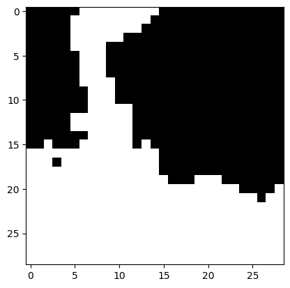
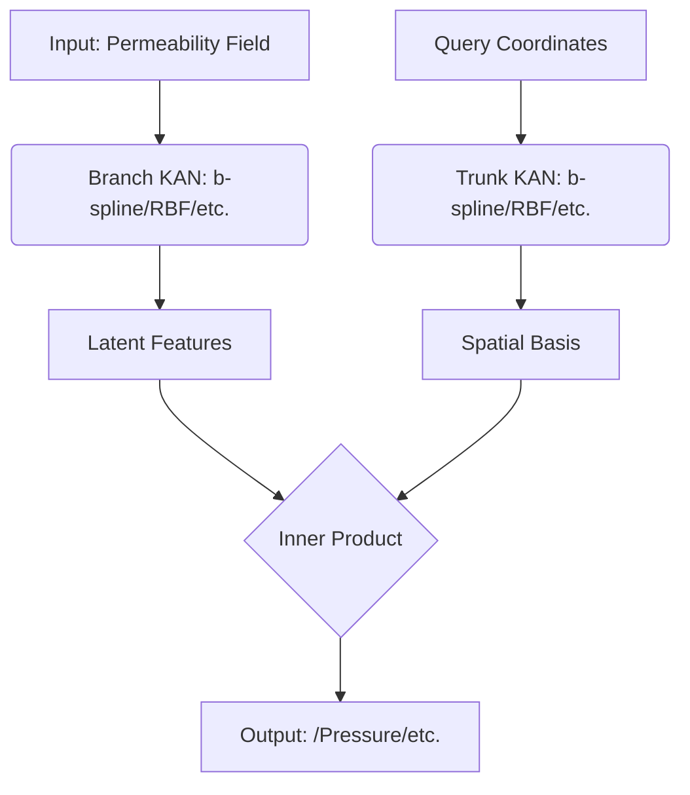
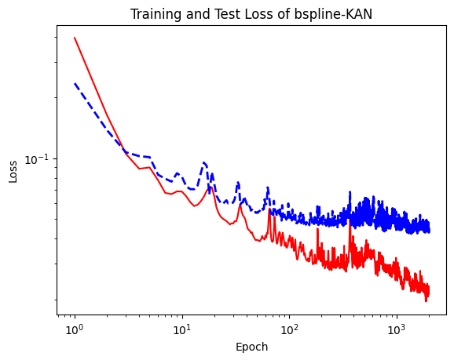
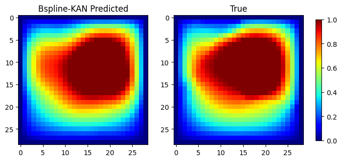

# PP-DeepOKAN
This is an onging project to combine the K-A representation theorem with Operator Learning model to endow the network architecture with better high-frequency expressivity with fewer learnable parameters.
## Introduction

### I. Kolmogorov-Arnold representation theorem
Kolmogorov-Arnold representation theorem states that if $f$ is a multivariate continuous function
on a bounded domain, then it can be written as a finite composition of continuous functions of a
single variable and the binary operation of addition. More specifically, for a smooth function $f : [0,1]^n \to \mathbb{R}^1$,


$$f(x) = f(x_1,...,x_n)=\sum_{q=1}^{2n+1}\Phi_q(\sum_{p=1}^n \phi_{q,p}(x_p))$$

where $\phi_{q,p}:[0,1]\to\mathbb{R}$ and $\Phi_q:\mathbb{R}\to\mathbb{R}$. In a sense, they showed that the only true multivariate function is addition, since every other function can be written using univariate functions and sum. However, this 2-Layer width-$(2n+1)$ Kolmogorov-Arnold representation may not be smooth due to its limited expressive power. We augment its expressive power by generalizing it to arbitrary depths and widths.

### II. Kolmogorov-Arnold Networks (KAN)
KANs are neural networks inspired by the Kolmogorov-Arnold theorem, where:

**Inner functions $(𝜙_{𝑞,𝑝})$:** 
transform input variables independently, uni-variable functions that connect the hidden neurons, which are the learnable edge function of the KAN.

**Outer functions $(Φ_𝑞)$:**
combine these transformations through summation and nonlinear mappings.

Unlike traditional MLPs (Multilayer Perceptrons), which apply fixed activation functions to weighted sums, KANs:

Use learnable univariate functions (e.g., splines, radial basis functions) instead of fixed activations.

Allow adaptive composition of functions across layers, improving interpretability and expressiveness.

KANs are particularly effective for function approximation with high frequency information and scientific machine learning, where interpretability and smoothness are crucial.

### III. DeepOKAN
DeepONet is a neural operator architecture designed to learn mappings between infinite-dimensional function spaces, making it ideal for solving parametric PDEs. It consists of:

**Branch Net**: Processes input functions (e.g., boundary conditions, geometric parameters). The branch net can be more than one to encode different conditioning information. We employ single/ multiple KAN networks for input functions encoding.

**Trunk Net**: Evaluates the output function at query points in the domain. The trunk net serves as the base neural field to approximate the PDE solution function. Similarly, the trunk net can also be a KAN network or other archs.

The output is a dot product of branch and trunk net features:
$$G(u)(y) = \sum_{k=1}^p \underbrace{b_k(u)}_{\text{Branch}} \cdot \underbrace{t_k(y)}_{\text{Trunk}}$$
where 𝑢 is the input function, 𝑦 is the query point (typically is the coordinates of any domain points), and $𝑏_𝑘$, $𝑡_𝑘$ are the hidden outputs of branch and trunk nets, respectively.

DeepONet excels in tasks like fluid dynamics, where the solution (e.g., velocity/pressure fields) depends on input parameters (e.g., Reynolds number, geometry). In the following chapter, we are going to ellaborate on an common task in geophysics and biofluidics, the surrogate modeling of 2D Darcy Flow, to illustrate the application of DeepOKAN.

### IV. Application example: 2D Darcy flow, pressure prediction

**1. Problem Background**
Darcy flow describes how fluids flow through porous media, governed by the Darcy's Law:

$$
∇·(c(x,y)∇p(x,y)) = f(x,y), \quad (x,y) ∈ Ω  
$$
where:

c(x,y): Permeability field (input, heterogeneous material property)

p(x,y): Pressure field (output solution)

f(x,y): Source/sink term

Ω: 2D spatial domain

This PDE plays fundamental roles in various scientific and industrial applications, such as:
Groundwater hydrology (aquifer modeling, contaminant transport), Oil reservoir simulation (enhanced oil recovery), Geothermal energy systems (heat transfer in fractured rocks),Biomedical engineering (tissue perfusion, drug delivery).

**2. Problem Description**
For simplification, we set most of the terms in the original PDE to constant values:
- c(x,y) = 0,1 (only permeable or impermeable)
- f(x,y) = 0 (no source/sink term)
- Ω = [0,1]×[0,1] (unit square domain)
The boundary conditions are as follows:
- p(x,0) = 0 (lower boundary in y-direction)
- p(x,1) = 1 (upper boundary in y-direction)
- c(x,0) = c(x,1) = 1 (permeability at left and right boundaries)
- u(0,y) = u(1,y) = 0 (no flow through left and right boundaries)

Given an 2D distribution of permeability c:

The model should predict the solution function, which is the pressure field p(x,y). 

**3. Model setting and Results**

PP-DeepOKAN predicts the pressure distributions over the domain by:

**Branch Network (KAN-based)**: Encodes permeability fields into latent features.
$$b_k = KAN(c(x, y))$$
where KAN can employ b-spline function, Radis-Base Function, Fourier series and etc. In current example, we employe RBF KAN, which exhibts higher efficiency in training.
**Trunk Network (KAN-based)**:

Evaluates the solution at spatial coordinates (𝑥, 𝑦).
$$t_k = KAN(x, y)$$
**Arch Illustration**


The final output is a generalized superposition of branch and trunk features:
$$ Pressure(x, y) = \sum_{k=1}^p b_k(x, y) \cdot t_k(x, y)$$

The hyperparameters of model arch and training porcess can be found in the ./conf/main.yaml file. The training curve is shown in the following figure:

**Results**:
The pressure field prediction relative err on the test set is 4.3 %, MSE is 0.007.


## Code

```sh
git clone https://github.com/PaddlePaddle/PaddleCFD.git
```

## Envs

```sh
pwd
cd ../../
env PYTHONPATH=$PYTHONPATH:$(pwd)   # set temporary path
pip install -r requirements.txt -i https://pypi.tuna.tsinghua.edu.cn/simple
cd ./examples/darcyflow/ppkan
pip install -r requirements.txt -i https://pypi.tuna.tsinghua.edu.cn/simple
```

## Data

We use an open-source PDE dataset for darcy flow task, more details about the data and preprocess methods please refer to [link](https://www.kaggle.com/datasets/scaomath/pde-dataset). You can either follow the subsequent instructions or acquire the same data following the instructions of the mentioned website.

### Get the dataset

#### If you want to get all files

We provide a demo dataset for the 2D Darcy flow prediction task, which can be downloaded using the following command:
```sh 
wget https://paddle-org.bj.bcebos.com/paddlecfd/datasets/ppkan/piececonst_r421_N1024_smooth1.mat
```
After download the dataset, pls put the file in ./data/***.mat folder.

### Prepocess scripts

The data preprocess follows the instructions that can be found in the mentinoed website and has been implemented in the main.py file, which invloves a simple downsample strategy to extract permeability fields. The dataset contains 1000 pairs of permeability fields "c", and corresbonding solution fields "y", we split 800 pairs for training and 200 pairs for testing.

## Run

### If you want to use our pretrained model

### Check config at first

Check setting of `DATA.path` in ppkan/conf/main.yaml, pls make sure the
path is correctly modified to the dataset directory where you download the 
pde dataset.

#### Train

```sh
env PYTHONPATH=$PYTHONPATH:$(pwd)
python main.py mode=train
```

#### Eval

```python
python main.py mode=test checkpoint="your checkpoint path"
# or using our pretrained checkpoint: "https://paddle-org.bj.bcebos.com/paddlecfd/checkpoints/ppkan/darcy/KANONet_Darcy.pdparams"
```

# References and citations

Reference paper: 10.1016/j.cma.2024.117699


Reference code: https://github.com/DiabAbu/DeepOKAN
