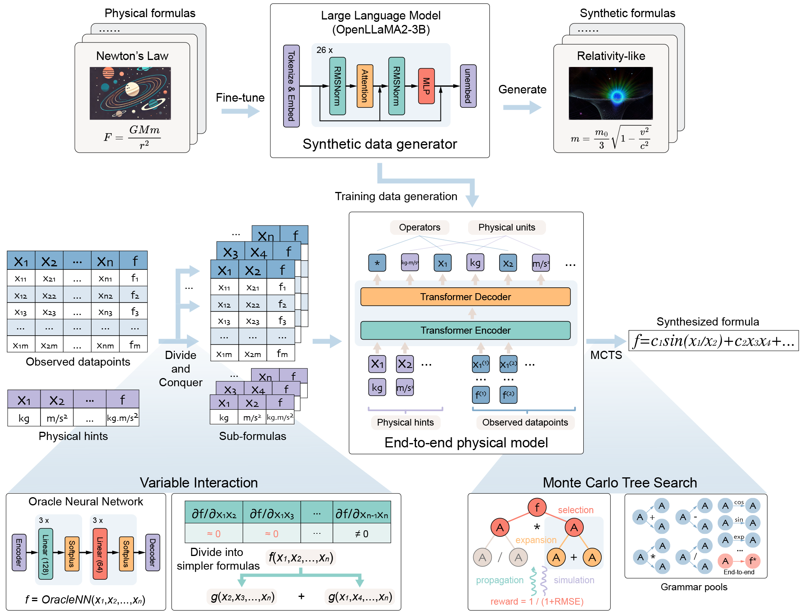

# A Neural Symbolic Model for Space Physics

This example integrates the Paddle version of PhysicsRegression into PaddleCFD for the paper [A Neural Symbolic Model for Space Physics](https://www.nature.com/articles/s42256-025-01126-3).



## Code Layout

- Core model package: `ppcfd/models/physicsregression`
- Training / evaluation / notebooks: `examples/physics_regression`

Public import path:

```python
from ppcfd.models.physicsregression import PhyReg
```

## Installation

Install PaddleCFD in editable mode from the repository root:

```bash
cd PaddleCFD
python -m pip install -e .
```

Make sure your Python environment already contains a compatible PaddlePaddle build.

## A Quick Start

A pre-trained model training on 6M synthetic formulas is avaliable from [Google Drive](https://drive.google.com/drive/folders/14M0Ed0gvSKmtuTOornfEoup8l48IfEUW).

The paddle pretrained model is also avaliable at [AIStudio](https://aistudio.baidu.com/modelsdetail/49148?modelId=49148). This model was directly converted from the original PyTorch model.

After downloading the pretrained checkpoint, you can play with `example.ipynb` as a demo example.

Other data which is necessary for training, evaluation and physics applications can be downloaded from [Google Drive](https://drive.google.com/drive/folders/17rbDLb2ZBgK9DidJtb1nyBFmGtOokhYs), and should be placed in the `data` directory.

The whole data required to reproduce the experiments is also avaliable at [FigShare](https://doi.org/10.6084/m9.figshare.29615831.v1).

## Training

To train a new Physics Regressor model on your own, use the following command with additional arguments (arg1,val1), (arg2,val2):

`python train.py --arg1 val1 --arg2 --val2`

We also includes a template for the training of our Physics Regressor model, using the following command:

`bash ./bash/train.sh`

> Attention: if you use custom devices for training, please modify the `--device` argument accordingly, such as `--device gpu:0` or `--device iluvatar:0`.

The training process consists of 100 epochs, with each epoch containing 500 training steps. The training time for each epoch ranges from 10 to 30 minutes when using a single 80GB A100 GPU. Occasionally, you may encounter the "CUDA: Out of Memory" error due to insufficient memory. In such cases, you can reduce the `tokens_per_batch` parameter, which defines the maximum number of tokens per batch, and increase `max_epoch` or `n_steps_per_epoch` parameter to maintain the same amount of training data. However, this may lead to different training outcomes.

The most useful hyper-parameters are presented in `./bash/train.sh`, while the others are specified in `examples/physics_regression/parsers.py` and `ppcfd/models/physicsregression/symbolicregression/envs/environment.py`.

- **`expr_train_data_path`**: The path to dataset for training. You can use our synthetic data in `data/exprs_train`, available at [Google Drive](https://drive.google.com/drive/folders/17rbDLb2ZBgK9DidJtb1nyBFmGtOokhYs), or use any specific data of your own.
- **`expr_valid_data_path`**: The path to dataset for validation. You can use our synthetic data in `data/exprs_valid`, available at [Google Drive](https://drive.google.com/drive/folders/17rbDLb2ZBgK9DidJtb1nyBFmGtOokhYs), or use any specific data of your own.
- **`sub_expr_train_path`**: The path to sub-formula dataset for training. You can use our synthetic data in `data/exprs_seperated_train`, available at [Google Drive](https://drive.google.com/drive/folders/17rbDLb2ZBgK9DidJtb1nyBFmGtOokhYs), or use any specific data of your own.
- **`sub_expr_valid_path`**: The path to sub-formula dataset for validation. You can use our synthetic data in `data/exprs_seperated_valid`, available at [Google Drive](https://drive.google.com/drive/folders/17rbDLb2ZBgK9DidJtb1nyBFmGtOokhYs), or use any specific data of your own.
- **`max_epoch`**: The maximum training epochs.
- **`n_steps_per_epoch`**: The maximum training steps for each epoch.
- **`max_len`**: The maximum number of datapoints for each formula.
- **`eval_size`**: The number of validation formulas after each training epoch.
- **`tokens_per_batch`**: The maximum token count per training batch.

### CINN acceleration

CINN ([docs](https://www.paddlepaddle.org.cn/documentation/docs/zh/guides/paddle_v3_features/cinn_cn.html)) is enabled by the `PHYE2E_USE_CINN` environment variable, which wraps the encoder/decoder with `paddle.jit.to_static`; CINN compiles automatically once wrapped. To train with CINN:

```bash
bash ./bash/train_cinn.sh
```

`train_small.sh` and `train_small_cinn.sh` are minimal-scale samples for a quick smoke test and a CINN-vs-baseline speedup comparison:

```bash
bash ./bash/train_small.sh        # baseline (pure dynamic graph)
bash ./bash/train_small_cinn.sh   # CINN enabled
```

#### Measured result: CINN gives no speedup for this model

Benchmarked on a single H800  (150 steps, steady-state
s/step measured from step 25 to 150 so that start-up and one-off compilation are excluded):

- Steady state: 0.53 s/step without CINN vs 0.55 s/step with CINN. Run-to-run spread is
  0.04 s/step (3 repeats), so the difference is **below measurement noise** — the
  steady-state effect of CINN is statistically indistinguishable from zero.
- One-off compilation costs ~420 s, i.e. **2-3x the entire 150-step training time**.
  There is no break-even point.

The reason is that this model is host-bound, not GPU-bound: measured GPU utilisation is
only 4-10%, and the compiled `fwd` region accounts for just ~4% of per-step CPU time.
Most of a step is spent in Python — encoding ~110k floats per step into ~350k token ids
via string formatting and vocabulary dict lookups — which contains no tensor ops at all
and is therefore outside what a tensor compiler can address.

Consequently, optimisation effort here should go into host-side vectorisation rather
than compiler tuning. Vectorising the encoding path cut per-step time from 0.85 s to
0.53 s (numerically identical output), a gain roughly 8x larger than the measurement
noise. Re-evaluate CINN only once GPU utilisation exceeds ~50% and the compiled region
accounts for more than ~20% of per-step time.

## Evaluation

Using our pre-trained model to evaluate, run the following command to evaluate the performance on synthetic dataset or feynman dataset:

`bash ./bash/eval_synthetic.sh`

`bash ./bash/eval_feynman.sh`

If you want to evaluate a pretrained inference model, set `reload_model` to a Paddle native `model.pdparams`. If you want to resume training, set `reload_checkpoint` to a Paddle training checkpoint such as `checkpoint.pth`.

The Divide-and-Conquer strategy requires training of oracle models. A small demo oracle checkpoint is bundled inside `examples/physics_regression/Oracle_model/demo`, while larger oracle assets should still be downloaded externally when needed.

Similarly, the most useful hyper-parameters for evaluation are presented in `./bash/eval_synthetic.sh`, which is listed below,

- **`eval_size`**: The numbers of formulas to evaluate.
- **`batch_size_eval`**: The numbers of formulas to evaluate per batch.
- **`filename`**: The path to save evaluation results.
- **`oraclename`**: The path to save oracle neural network model.
- **`max_len`**: The number of datapoints for each formula.
- **`reload_model`**: The path to a Paddle native inference model (`model.pdparams`).
- **`reload_checkpoint`**: The path to a Paddle training checkpoint for resuming training (`checkpoint.pth`).
- **`expr_test_data_path`**: The path to the evaluation dataset. A small default test file is bundled in `examples/physics_regression/data/exprs_test_ranked.json`.

## Applications

The `physical` directory contains 5 physics application including SSN prediction, equator plasma pressure prediction, solar differential rotation prediction, contribution function prediction, lunar tide effect prediction.

The data for each physics cases can be found from [Google Drive](https://drive.google.com/drive/folders/17rbDLb2ZBgK9DidJtb1nyBFmGtOokhYs), and should also be placed in the `examples/physics_regression/data` directory, as mentioned above.

There are five Jupyter notebooks in the `physical` directory, each corresponding to one of the five real-world physics Symbolic Regression cases in the paper. These notebooks now depend on the PaddleCFD-integrated package under `ppcfd.models.physicsregression`.

## Citation

```bibtex
 @article{Ying_Lin_Yue_Chen_Xiao_Shi_Liang_Yau_Zhou_Ma_2025,
  title={A neural symbolic model for space physics},
  volume={7},
  url={http://dx.doi.org/10.1038/s42256-025-01126-3},
  DOI={10.1038/s42256-025-01126-3}, number={10},
  journal={Nature Machine Intelligence},
  publisher={Springer Science and Business Media LLC},
  author={Ying, Jie and Lin, Haowei and Yue, Chao and Chen, Yajie and Xiao, Chao and Shi, Quanqi and Liang, Yitao and Yau, Shing-Tung and Zhou, Yuan and Ma, Jianzhu},
  year={2025},
  month=oct,
  pages={1726–1741},
  language={en}
}

```
